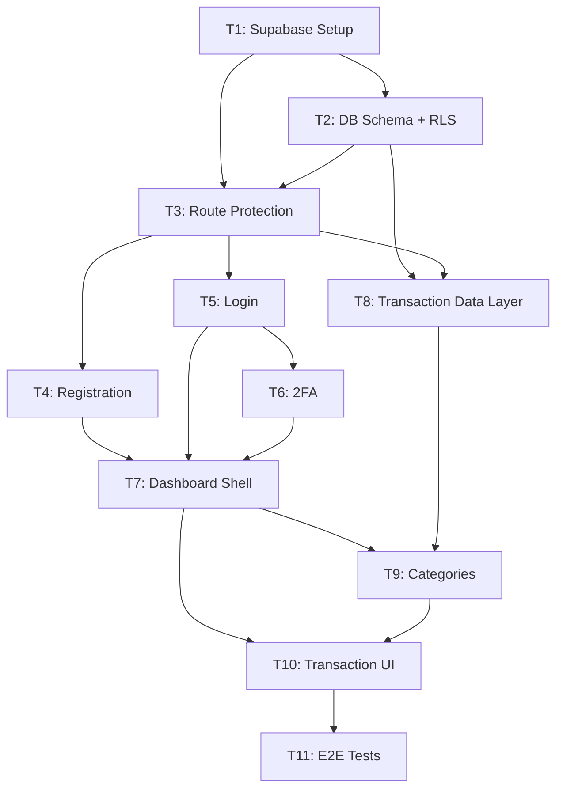

# Implementation Plan: Phase 1 Foundation (MVP) — Finance Lifestyle OS

## Executive Summary

Build the Phase 1 MVP for the Finance Lifestyle OS web app: Supabase infrastructure, user auth (registration, login, 2FA), manual transaction entry, category management, and real-time cross-platform sync. 11 tasks, 33 estimated hours.

### Key Technical Decisions

| Decision | Rationale |
|----------|-----------|
| Supabase Auth + RLS | No custom auth plumbing; data isolation enforced at DB level |
| Next.js Server Actions for mutations | Colocates validation + DB calls; works with App Router |
| `@supabase/ssr` for sessions | Official Next.js pattern; cookie-based session refresh in middleware |
| Supabase Realtime for sync | Built-in; zero extra infra; `postgres_changes` subscriptions |

### Risk Factors

| Risk | Mitigation |
|------|------------|
| Next.js 16 async Request API breaking changes | All `params`/`cookies()`/`headers()` must be `await`-ed — enforced in scaffolds |
| RLS misconfiguration leaking cross-user data | Dedicated migration tested before any feature work (T2) |
| No test framework yet | Add Playwright in T11; verify with `tsc` + `eslint` per task until then |

---

## Source Traceability

| Field | Value |
|-------|-------|
| **Stories** | US-001, US-002, US-004, US-006, US-007, US-008 |
| **Phase** | Phase 1 — Foundation (MVP) |
| **Total Story Points** | 19 pts |

### Acceptance Criteria Mapping

| AC | Summary | Task(s) |
|----|---------|---------|
| US-001 AC-1 | Registration → auto-login → dashboard | T4 |
| US-001 AC-2 | Duplicate email rejected | T4 |
| US-001 AC-3 | Password validation (min 8 chars + number) | T4 |
| US-001 AC-4 | Verification email sent | T4 |
| US-002 AC-1 | Login → dashboard | T5 |
| US-002 AC-2 | Invalid credentials → error | T5 |
| US-002 AC-3 | Session persists across restarts | T3, T5 |
| US-002 AC-4 | Logout invalidates session | T5 |
| US-004 AC-1 | 2FA TOTP enrollment + backup codes | T6 |
| US-004 AC-2 | 2FA challenge on login when enabled | T6 |
| US-004 AC-3 | 2FA disable with password confirm | T6 |
| US-006 AC-1 | Create transaction via web form | T10 |
| US-006 AC-2 | Edit transaction | T10 |
| US-006 AC-3 | Delete with confirm | T10 |
| US-007 AC-1 | Default categories seeded | T2 |
| US-007 AC-2 | Create custom category | T9 |
| US-007 AC-3 | Delete requires transaction reassignment | T9 |
| US-008 AC-1 | New transaction visible in other tab within 5s | T8 |
| US-008 AC-3 | No duplicate data from concurrent edits | T8 |

---

## Codebase Conventions

| Convention | Pattern |
|------------|---------|
| Async APIs | `await cookies()`, `await params` — Next.js 16 mandatory |
| Path alias | `@/*` → `apps/web/` root (not src/) |
| Styling | Tailwind v4, tokens in `globals.css @theme inline {}` |
| Supabase clients | `createBrowserClient` (client), `createServerClient` (server) from `@supabase/ssr` |
| Server actions | `'use server'` directive; return `{ error } \| { success }` |
| Client components | `'use client'` only when hooks/events needed |
| Linting | `pnpm eslint .` from `apps/web/` (`next lint` deprecated in v16) |
| Error handling | Return typed result objects; display inline in forms |
| New directories | `components/`, `lib/`, `hooks/` under `apps/web/` |

---

## Execution Strategy

| Wave | Tasks | Hours | Description |
|------|-------|-------|-------------|
| 1 | T1 | 2h | Supabase clients + middleware |
| 2 | T2 | 3h | Database schema + RLS migrations |
| 3 | T3 | 3h | Route protection + auth layouts |
| 4 | T4, T5 | 4h + 3h | Registration + login (parallel) |
| 5 | T6 | 4h | 2FA (depends on login) |
| 6 | T7, T8 | 3h + 4h | Dashboard shell + data layer (parallel) |
| 7 | T9 | 3h | Category management |
| 8 | T10 | 5h | Transaction entry UI |
| 9 | T11 | 2h | E2E tests + Playwright setup |

**Total estimated hours**: 33h
**Critical path**: T1 → T2 → T3 → T5 → T6 → T7 → T10 → T11 (26h)

---

## Task Breakdown

### Task 1: Supabase Setup + Environment Config

**What to do**: Install `@supabase/supabase-js` and `@supabase/ssr`, create browser/server Supabase client helpers, and set up Next.js middleware for automatic session refresh.

**Key steps**:
- `pnpm add @supabase/supabase-js @supabase/ssr` in `apps/web/`
- Create `apps/web/lib/supabase/client.ts` using `createBrowserClient`
- Create `apps/web/lib/supabase/server.ts` using `createServerClient` with `await cookies()`
- Create `apps/web/middleware.ts` — call `supabase.auth.getUser()` to refresh token on every request
- Create `apps/web/.env.local.example` with `NEXT_PUBLIC_SUPABASE_URL` and `NEXT_PUBLIC_SUPABASE_ANON_KEY`

| | |
|---|---|
| **Estimated Hours** | 2h |
| **Dependencies** | None |
| **Blocks** | T2, T3, T4, T5, T8 |
| **Files** | `lib/supabase/client.ts` (Create), `lib/supabase/server.ts` (Create), `middleware.ts` (Create), `.env.local.example` (Create), `package.json` (Modify) |
| **Linked AC** | US-002 AC-3 |

---

### Task 2: Database Schema + Migrations

**What to do**: Create Supabase migration SQL files for the core schema (profiles, categories with 12 seeded defaults, transactions) and RLS policies, plus TypeScript types matching the schema.

**Key steps**:
- `supabase/migrations/001_initial_schema.sql`: `profiles`, `categories` (seeded with 12 defaults, `user_id = NULL`), `transactions` with `transaction_source` enum
- `supabase/migrations/002_rls_policies.sql`: Enable RLS on all tables; per-user policies; categories allow `user_id IS NULL OR user_id = auth.uid()` for SELECT
- Rollback SQL for both migrations
- `apps/web/types/database.ts`: TypeScript `Database` interface + row type aliases

| | |
|---|---|
| **Estimated Hours** | 3h |
| **Dependencies** | T1 |
| **Blocks** | T3, T8, T9 |
| **Files** | `supabase/migrations/001_initial_schema.sql` (Create), `supabase/migrations/001_initial_schema_down.sql` (Create), `supabase/migrations/002_rls_policies.sql` (Create), `supabase/migrations/002_rls_policies_down.sql` (Create), `apps/web/types/database.ts` (Create) |
| **Linked AC** | US-007 AC-1, US-008 AC-3 |

---

### Task 3: Route Protection + Auth Layouts

**What to do**: Update middleware with auth redirect logic, create the `(auth)` route group layout and `dashboard` protected layout, and replace the root page with an auth-aware redirect.

**Key steps**:
- Middleware: redirect unauthenticated → `/login` if path starts with `/dashboard`; redirect authenticated → `/dashboard` if on `/login` or `/register`
- `app/(auth)/layout.tsx`: centered card wrapper, no navigation
- `app/dashboard/layout.tsx`: server component, calls `getUser()`, redirects if no session
- `app/page.tsx`: replace placeholder with session check + redirect

| | |
|---|---|
| **Estimated Hours** | 3h |
| **Dependencies** | T1, T2 |
| **Blocks** | T4, T5, T6, T7 |
| **Files** | `middleware.ts` (Modify), `app/(auth)/layout.tsx` (Create), `app/dashboard/layout.tsx` (Create), `app/page.tsx` (Modify) |
| **Linked AC** | US-002 AC-3, US-002 AC-4 |

---

### Task 4: Registration Page (US-001)

**What to do**: Build the registration page with client-side `RegisterForm` component using React 19 `useActionState`, a `registerUser` server action calling `supabase.auth.signUp()`, and inline validation errors.

**Key steps**:
- `lib/actions/auth.ts`: `registerUser` server action with Zod validation (email, password ≥8 chars + number, confirm match); call `supabase.auth.signUp()`; map Supabase errors to friendly messages
- `components/auth/RegisterForm.tsx`: `'use client'`, `useActionState(registerUser)`, `useFormStatus` for submit loading, show success "Check your email" state
- `app/(auth)/register/page.tsx`: server component wrapping `<RegisterForm />`
- `pnpm add zod` for validation

| | |
|---|---|
| **Estimated Hours** | 4h |
| **Dependencies** | T3 |
| **Blocks** | T7 |
| **Files** | `lib/actions/auth.ts` (Create), `components/auth/RegisterForm.tsx` (Create), `app/(auth)/register/page.tsx` (Create) |
| **Linked AC** | US-001 AC-1, AC-2, AC-3, AC-4 |

---

### Task 5: Login Page (US-002)

**What to do**: Build the login page reusing `loginUser` and `logoutUser` from `auth.ts`, add a `LoginForm` client component, and create the email verification callback route handler.

**Key steps**:
- `loginUser` action in `auth.ts` (add to file from T4): `signInWithPassword()` → `redirect('/dashboard')` on success; return `{ error: 'Invalid email or password' }` on failure
- `logoutUser` action: `signOut()` → `redirect('/login')`
- `components/auth/LoginForm.tsx`: mirrors RegisterForm pattern
- `app/auth/callback/route.ts`: `GET` handler that calls `exchangeCodeForSession(code)` → redirect to dashboard

| | |
|---|---|
| **Estimated Hours** | 3h |
| **Dependencies** | T3 |
| **Blocks** | T6, T7 |
| **Files** | `lib/actions/auth.ts` (Modify — add loginUser/logoutUser), `components/auth/LoginForm.tsx` (Create), `app/(auth)/login/page.tsx` (Create), `app/auth/callback/route.ts` (Create) |
| **Linked AC** | US-002 AC-1, AC-2, AC-3, AC-4 |

---

### Task 6: Two-Factor Authentication (US-004)

**What to do**: Implement TOTP 2FA using Supabase MFA APIs — enrollment with QR code display, challenge screen shown after password login, and disable flow in security settings.

**Key steps**:
- `lib/actions/mfa.ts`: `enrollMFA()` → `supabase.auth.mfa.enroll({ factorType: 'totp' })`; `verifyMFAChallenge()` → `challengeAndVerify()`; `unenrollMFA()` → `unenroll()`
- Update `loginUser` in `auth.ts`: after signIn, check `mfa.getAuthenticatorAssuranceLevel()` — if `nextLevel === 'aal2'` redirect to `/verify-2fa`
- `components/auth/TwoFactorSetup.tsx`: step-by-step (start → scan QR → verify code → show backup codes)
- `app/(auth)/verify-2fa/page.tsx`: TOTP entry screen with `verifyMFAChallenge` action
- `app/dashboard/settings/security/page.tsx`: shows 2FA status + enable/disable UI

| | |
|---|---|
| **Estimated Hours** | 4h |
| **Dependencies** | T5 |
| **Blocks** | T7 |
| **Files** | `lib/actions/mfa.ts` (Create), `components/auth/TwoFactorSetup.tsx` (Create), `components/auth/TwoFactorVerify.tsx` (Create), `app/(auth)/verify-2fa/page.tsx` (Create), `app/dashboard/settings/security/page.tsx` (Create), `lib/actions/auth.ts` (Modify — add AAL check) |
| **Linked AC** | US-004 AC-1, AC-2, AC-3 |

---

### Task 7: Dashboard Shell + Navigation

**What to do**: Build the sidebar navigation, top bar with user info + logout, and the dashboard home page. Integrate them into the dashboard layout.

**Key steps**:
- `components/layout/Sidebar.tsx`: `'use client'`, uses `usePathname()` for active link; links to Overview, Transactions, Categories, Security
- `components/layout/TopBar.tsx`: async server component; shows `user.email`; form with `logoutUser` action
- `app/dashboard/page.tsx`: server component, fetches user profile, shows greeting + placeholder metric cards
- Update `app/dashboard/layout.tsx` to render `<Sidebar>` + `<TopBar>`

| | |
|---|---|
| **Estimated Hours** | 3h |
| **Dependencies** | T4, T5, T6 |
| **Blocks** | T9, T10 |
| **Files** | `components/layout/Sidebar.tsx` (Create), `components/layout/TopBar.tsx` (Create), `app/dashboard/page.tsx` (Create), `app/dashboard/layout.tsx` (Modify) |
| **Linked AC** | US-002 AC-4 |

---

### Task 8: Transaction Data Layer + Real-Time Hook (US-008)

**What to do**: Create server query functions, server actions for transaction CRUD, and a `useTransactions` client hook that subscribes to Supabase Realtime so changes appear in all open tabs within 5 seconds.

**Key steps**:
- `lib/supabase/queries/transactions.ts`: `getTransactions()` — select with category join, ordered by date desc
- `lib/actions/transactions.ts`: `createTransaction`, `updateTransaction`, `deleteTransaction` server actions; all verify ownership; call `revalidatePath`
- `hooks/useTransactions.ts`: `'use client'`; accepts `initialData`; subscribes to `postgres_changes` on `transactions`; handles INSERT/UPDATE/DELETE events to mutate local state

| | |
|---|---|
| **Estimated Hours** | 4h |
| **Dependencies** | T2, T3 |
| **Blocks** | T9, T10 |
| **Files** | `lib/supabase/queries/transactions.ts` (Create), `lib/actions/transactions.ts` (Create), `hooks/useTransactions.ts` (Create) |
| **Linked AC** | US-008 AC-1, AC-3 |

---

### Task 9: Category Management (US-007)

**What to do**: Build category CRUD — settings page listing system defaults (read-only) + user-created categories, add/edit form, and deletion with mandatory transaction reassignment when categories are in use.

**Key steps**:
- `lib/actions/categories.ts`: `createCategory`, `updateCategory`, `deleteCategory` — delete checks `COUNT(transactions)` first; returns `{ requiresReassignment: true }` if in use and no `reassignToId` provided
- `hooks/useCategories.ts`: client hook for category list (used in TransactionForm)
- `app/dashboard/settings/categories/page.tsx`: server component fetching categories; renders `CategoryList`
- `components/categories/CategoryList.tsx`: system defaults shown as read-only; user categories show edit/delete
- `components/categories/CategoryForm.tsx`: name + color picker (12 preset colors)

| | |
|---|---|
| **Estimated Hours** | 3h |
| **Dependencies** | T7, T8 |
| **Blocks** | T10 |
| **Files** | `lib/actions/categories.ts` (Create), `hooks/useCategories.ts` (Create), `app/dashboard/settings/categories/page.tsx` (Create), `components/categories/CategoryList.tsx` (Create), `components/categories/CategoryForm.tsx` (Create) |
| **Linked AC** | US-007 AC-2, AC-3 |

---

### Task 10: Manual Transaction Entry UI (US-006)

**What to do**: Build the transactions list page (server-fetched initial data + Realtime updates) and the add/edit transaction form with amount, merchant, category select, date picker, and optional note.

**Key steps**:
- `app/dashboard/transactions/page.tsx`: server component; fetches `getTransactions()` as `initialData`; passes to `TransactionList`
- `components/transactions/TransactionList.tsx`: `'use client'`; uses `useTransactions(initialData)`; shows transaction rows with Edit link + Delete with confirm dialog
- `components/transactions/TransactionForm.tsx`: handles create and edit mode (optional `transaction` prop); amount (numeric, PLN), merchant (text), category (select), date (date input, max=today), note (optional)
- `app/dashboard/transactions/new/page.tsx`: fetches categories server-side, renders `TransactionForm`

| | |
|---|---|
| **Estimated Hours** | 5h |
| **Dependencies** | T7, T9 |
| **Blocks** | T11 |
| **Files** | `app/dashboard/transactions/page.tsx` (Create), `app/dashboard/transactions/new/page.tsx` (Create), `components/transactions/TransactionList.tsx` (Create), `components/transactions/TransactionForm.tsx` (Create) |
| **Linked AC** | US-006 AC-1, AC-2, AC-3; US-008 AC-1 |

---

### Task 11: E2E Integration Test + Playwright Setup

**What to do**: Install Playwright, configure it to run against the local dev server, and write smoke tests for the auth flow and transaction real-time sync.

**Key steps**:
- `pnpm add -D @playwright/test && npx playwright install chromium`
- `playwright.config.ts`: target `http://localhost:3000`; auto-start dev server; chromium only for Phase 1
- `__tests__/e2e/auth.spec.ts`: test unauthenticated redirect, invalid login error, registration flow
- `__tests__/e2e/transactions.spec.ts`: test transaction create → appears in list; test real-time sync across two browser contexts

| | |
|---|---|
| **Estimated Hours** | 2h |
| **Dependencies** | T10 |
| **Blocks** | None |
| **Files** | `package.json` (Modify), `playwright.config.ts` (Create), `__tests__/e2e/auth.spec.ts` (Create), `__tests__/e2e/transactions.spec.ts` (Create) |
| **Linked AC** | US-001 AC-1, US-002 AC-1, US-006 AC-1, US-008 AC-1 |

---

## Dependency Graph

---

## File Changes Summary

### Files to Create (39 total)

| File | Task |
|------|------|
| `apps/web/lib/supabase/client.ts` | T1 |
| `apps/web/lib/supabase/server.ts` | T1 |
| `apps/web/middleware.ts` | T1 |
| `apps/web/.env.local.example` | T1 |
| `apps/web/types/database.ts` | T2 |
| `supabase/migrations/001_initial_schema.sql` + `_down.sql` | T2 |
| `supabase/migrations/002_rls_policies.sql` + `_down.sql` | T2 |
| `apps/web/app/(auth)/layout.tsx` | T3 |
| `apps/web/app/dashboard/layout.tsx` | T3 |
| `apps/web/lib/actions/auth.ts` | T4 |
| `apps/web/components/auth/RegisterForm.tsx` | T4 |
| `apps/web/app/(auth)/register/page.tsx` | T4 |
| `apps/web/components/auth/LoginForm.tsx` | T5 |
| `apps/web/app/(auth)/login/page.tsx` | T5 |
| `apps/web/app/auth/callback/route.ts` | T5 |
| `apps/web/lib/actions/mfa.ts` | T6 |
| `apps/web/components/auth/TwoFactorSetup.tsx` | T6 |
| `apps/web/components/auth/TwoFactorVerify.tsx` | T6 |
| `apps/web/app/(auth)/verify-2fa/page.tsx` | T6 |
| `apps/web/app/dashboard/settings/security/page.tsx` | T6 |
| `apps/web/components/layout/Sidebar.tsx` | T7 |
| `apps/web/components/layout/TopBar.tsx` | T7 |
| `apps/web/app/dashboard/page.tsx` | T7 |
| `apps/web/lib/supabase/queries/transactions.ts` | T8 |
| `apps/web/lib/actions/transactions.ts` | T8 |
| `apps/web/hooks/useTransactions.ts` | T8 |
| `apps/web/lib/actions/categories.ts` | T9 |
| `apps/web/hooks/useCategories.ts` | T9 |
| `apps/web/app/dashboard/settings/categories/page.tsx` | T9 |
| `apps/web/components/categories/CategoryList.tsx` | T9 |
| `apps/web/components/categories/CategoryForm.tsx` | T9 |
| `apps/web/app/dashboard/transactions/page.tsx` | T10 |
| `apps/web/app/dashboard/transactions/new/page.tsx` | T10 |
| `apps/web/components/transactions/TransactionList.tsx` | T10 |
| `apps/web/components/transactions/TransactionForm.tsx` | T10 |
| `apps/web/playwright.config.ts` | T11 |
| `apps/web/__tests__/e2e/auth.spec.ts` | T11 |
| `apps/web/__tests__/e2e/transactions.spec.ts` | T11 |

### Files to Modify (4 total)

| File | Changes | Task |
|------|---------|------|
| `apps/web/package.json` | Add supabase, zod, playwright deps | T1, T4, T11 |
| `apps/web/app/page.tsx` | Replace placeholder with auth redirect | T3 |
| `apps/web/middleware.ts` | Add redirect logic | T3 |
| `apps/web/app/dashboard/layout.tsx` | Add Sidebar + TopBar | T7 |

### Database Migrations

| Migration | Task |
|-----------|------|
| `001_initial_schema.sql` + rollback | T2 |
| `002_rls_policies.sql` + rollback | T2 |

---

## Implementation Checklist

### Before Starting
- [ ] Supabase project created + credentials in `.env.local`
- [ ] `NEXT_PUBLIC_SITE_URL` set (for email verification redirect)
- [ ] Supabase email confirmation enabled in Auth settings
- [ ] Supabase Realtime enabled: `ALTER TABLE transactions REPLICA IDENTITY FULL`

### Task Progress
- [ ] T1 complete — Supabase clients working
- [ ] T2 complete — migrations applied, types compile
- [ ] T3 complete — unauthenticated /dashboard redirects to /login
- [ ] T4 complete — can register + receive verification email
- [ ] T5 complete — can login, session persists, logout works
- [ ] T6 complete — can enroll 2FA, challenged on login, can disable
- [ ] T7 complete — dashboard shell renders
- [ ] T8 complete — transactions CRUD + Realtime subscription
- [ ] T9 complete — categories CRUD working
- [ ] T10 complete — transaction form create/edit/delete working
- [ ] T11 complete — Playwright tests passing

### Before Code Review
- [ ] `npx tsc --noEmit` zero errors
- [ ] `pnpm lint` zero warnings
- [ ] RLS verified: cross-user data isolation confirmed
- [ ] Real-time sync manually tested in two browser tabs

---

## Metadata

| Field | Value |
|-------|-------|
| **Plan ID** | IP-20260331-001 |
| **Source** | US-001, US-002, US-004, US-006, US-007, US-008 (Phase 1 MVP) |
| **Created** | 2026-03-31 |
| **Author** | code-craftsman |
| **Status** | Draft |
| **Total Estimated Hours** | 33h |
| **Full Plan** | `docs/implementation-plans/IP-20260331-001-full.md` |

---

## Revision History

| Version | Date | Author | Changes |
|---------|------|--------|---------|
| 1.0 | 2026-03-31 | code-craftsman | Initial plan — Phase 1 MVP |
