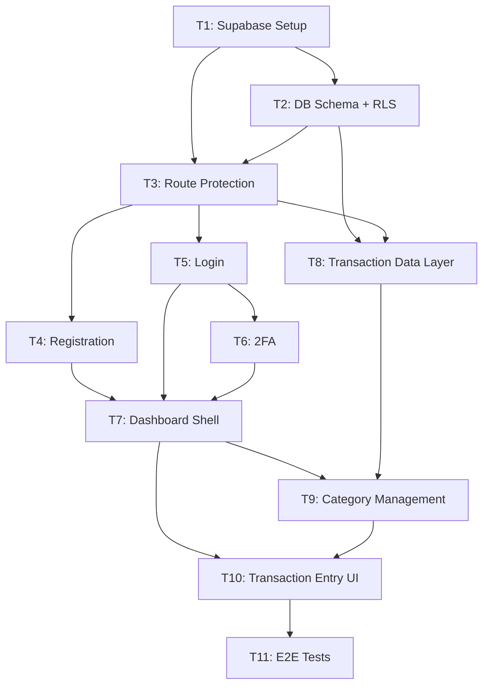
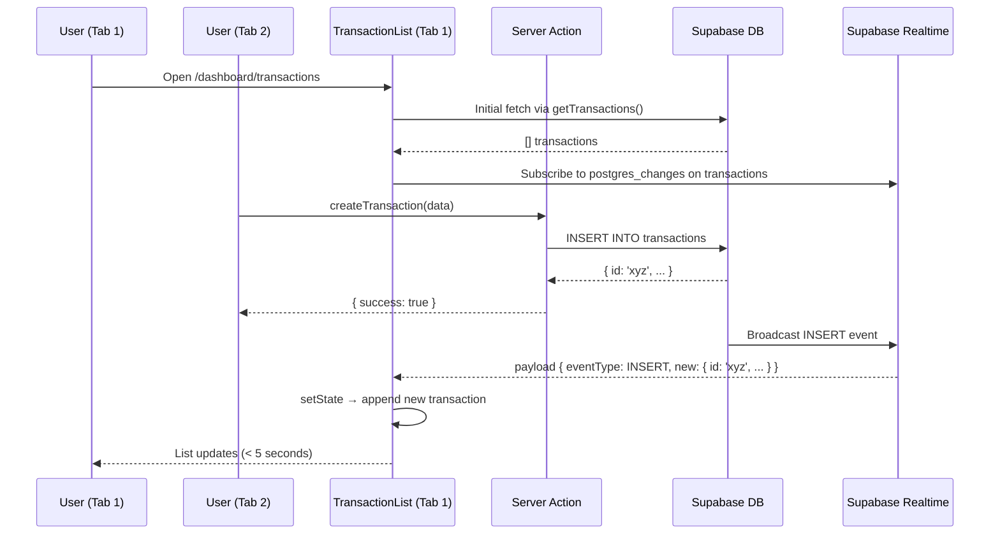
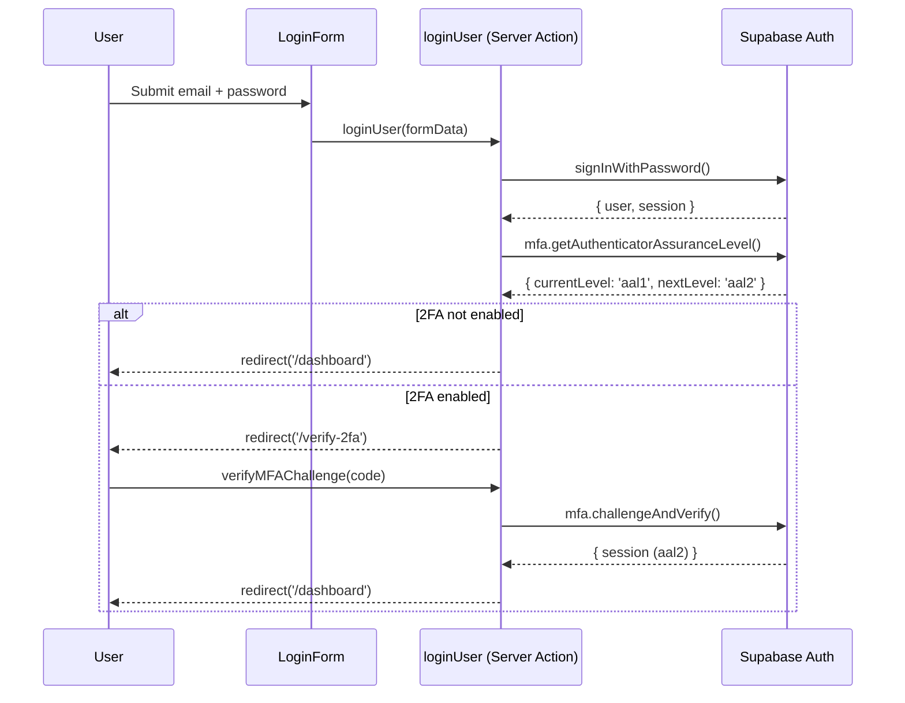

# Implementation Plan: Phase 1 Foundation (MVP) — Finance Lifestyle OS

## Executive Summary

Build the Phase 1 MVP foundation for Finance Lifestyle OS web app: Supabase infrastructure (auth, database, real-time), user authentication (registration, login, 2FA), manual transaction entry, category management, and real-time cross-platform sync. This plan covers the Next.js web app only — React Native mobile is a separate phase. All 11 tasks build sequentially from infrastructure upward to UI, with the Supabase data layer as the critical dependency for all feature work.

### Key Technical Decisions

| Decision | Rationale |
|----------|-----------|
| Supabase Auth + RLS for all data access | Eliminates custom auth plumbing; RLS enforces per-user data isolation at DB level |
| Next.js Server Actions for mutations | Avoids separate API routes for simple CRUD; colocates validation + DB calls; works with App Router |
| `@supabase/ssr` for session management | Official Supabase pattern for Next.js App Router; handles cookie-based session refresh in middleware |
| Supabase Realtime for US-008 sync | Built into Supabase; zero extra infrastructure; `postgres_changes` subscriptions per user |
| Tailwind v4 CSS-in-CSS | Already in project; add design tokens to `globals.css @theme inline {}` — no config file |

### Risk Factors

| Risk | Mitigation |
|------|------------|
| Next.js 16 async Request API breaking changes | All `params`, `cookies()`, `headers()`, `searchParams` must be `await`-ed — scaffolds enforce this |
| Supabase RLS misconfiguration leaking data | Dedicated migration for RLS policies; verified in T2 before any feature work |
| No test framework configured yet | Verification uses `tsc --noEmit` + `eslint`; Playwright added in T11 for E2E smoke test |

---

## Source Traceability

### User Story Reference

| Field | Value |
|-------|-------|
| **Stories** | US-001, US-002, US-004, US-006, US-007, US-008 |
| **Phase** | Phase 1 — Foundation (MVP) |
| **Total Story Points** | 19 pts |
| **Priority** | P0-Critical (US-001, US-002, US-006, US-008), P1-High (US-004, US-007) |

### Acceptance Criteria Mapping

| AC ID | Acceptance Criteria Summary | Implementing Task(s) |
|-------|----------------------------|---------------------|
| US-001 AC-1 | Successful registration → auto-login → dashboard | T4 |
| US-001 AC-2 | Duplicate email rejected with message | T4 |
| US-001 AC-3 | Password validation (min 8 chars + number) | T4 |
| US-001 AC-4 | Email verification sent on registration | T4 |
| US-002 AC-1 | Login with correct credentials → dashboard | T5 |
| US-002 AC-2 | Invalid credentials → error message | T5 |
| US-002 AC-3 | Session persists across app restarts | T3, T5 |
| US-002 AC-4 | Logout invalidates session | T5 |
| US-004 AC-1 | 2FA enrollment with TOTP QR code + backup codes | T6 |
| US-004 AC-2 | 2FA required on login when enabled | T6 |
| US-004 AC-3 | 2FA disable with password confirmation | T6 |
| US-006 AC-1 | Create transaction via web form | T10 |
| US-006 AC-2 | Edit existing transaction | T10 |
| US-006 AC-3 | Delete transaction with confirm prompt | T10 |
| US-007 AC-1 | Default categories pre-seeded | T2 |
| US-007 AC-2 | Custom category creation | T9 |
| US-007 AC-3 | Category with transactions requires reassignment before delete | T9 |
| US-008 AC-1 | Transaction added on web appears on other open tab within 5s | T8 |
| US-008 AC-3 | No duplicate data from concurrent edits | T8 |

---

## Codebase Conventions

| Convention | Pattern | Notes |
|------------|---------|-------|
| **Async Request APIs** | `const cookieStore = await cookies()` — ALWAYS await | Next.js 16 breaking change — synchronous access removed |
| **Server components** | `async function Page()` — async by default | Use for data fetching; no `useEffect` for initial data |
| **Server actions** | `'use server'` at top of file or function | Used for all mutations (create/update/delete) |
| **Client components** | `'use client'` directive at top | Only when hooks/event handlers needed |
| **Path alias** | `@/components/...`, `@/lib/...`, `@/hooks/...` | Resolves to `apps/web/` root |
| **Styling** | Tailwind v4 utility classes; tokens in `globals.css @theme inline {}` | No `tailwind.config.js` ever |
| **Naming** | kebab-case file names, PascalCase components, camelCase functions | Follow Next.js conventions |
| **Imports** | Absolute `@/...` for project files; relative for co-located files | No barrel exports yet |
| **Linting** | `pnpm eslint` from `apps/web/` or `pnpm lint` from root | `next lint` deprecated in Next.js 16 |
| **Supabase clients** | `createBrowserClient` for `'use client'`; `createServerClient` for server components/actions | From `@supabase/ssr` |
| **Error handling** | Return `{ error: string } | { data: T }` from server actions; show errors inline in forms | No thrown errors to client |

---

## Execution Strategy

| Wave | Tasks | Hours | Description |
|------|-------|-------|-------------|
| 1 | T1 | 2h | Supabase clients + middleware — no dependencies |
| 2 | T2 | 3h | Database schema + RLS migrations |
| 3 | T3 | 3h | Route protection + auth layouts |
| 4 | T4, T5 | 4h + 3h | Registration + login pages in parallel |
| 5 | T6 | 4h | 2FA (depends on login) |
| 6 | T7, T8 | 3h + 4h | Dashboard shell + transaction data layer in parallel |
| 7 | T9 | 3h | Category management (depends on T7 + T8) |
| 8 | T10 | 5h | Transaction entry UI (depends on T7 + T9) |
| 9 | T11 | 2h | E2E integration test + Playwright setup |

**Total estimated hours**: 33h
**Critical path**: T1 → T2 → T3 → T5 → T6 → T7 → T10 → T11 (26h)

---

## Task Breakdown

---

### Task 1: Supabase Setup + Environment Config

**Description**: Install Supabase client libraries, create browser/server/middleware helper files following the `@supabase/ssr` pattern for Next.js App Router, and set up the Next.js middleware for automatic session refresh. This is the foundation everything else depends on.

**Estimated Hours**: 2

**Dependencies**: None

**Blocks**: T2, T3, T4, T5, T8

**Files**:
| File | Action | Description |
|------|--------|-------------|
| `apps/web/package.json` | Modify | Add @supabase/supabase-js, @supabase/ssr dependencies |
| `apps/web/.env.local.example` | Create | Template for required environment variables |
| `apps/web/lib/supabase/client.ts` | Create | Browser Supabase client (for client components) |
| `apps/web/lib/supabase/server.ts` | Create | Server Supabase client (for server components/actions) |
| `apps/web/middleware.ts` | Create | Next.js middleware for session refresh on every request |

**Implementation Notes**:
- Use `createBrowserClient` from `@supabase/ssr` for client-side — singleton pattern to avoid multiple instances
- Use `createServerClient` from `@supabase/ssr` for server-side — must receive cookies from `next/headers`
- Middleware must call `supabase.auth.getUser()` to refresh session tokens automatically
- In Next.js 16, `cookies()` from `next/headers` is async — must `await` it before passing to `createServerClient`
- Middleware matcher should exclude static assets and API routes that don't need auth

**Linked Acceptance Criteria**: US-002 AC-3 (session persistence)

**Verify**:
```bash
cd apps/web
pnpm add @supabase/supabase-js @supabase/ssr
npx tsc --noEmit
pnpm eslint .
```

**Code Scaffold**:

```typescript
// apps/web/lib/supabase/client.ts  [Create]
import { createBrowserClient } from '@supabase/ssr'
import type { Database } from '@/types/database'

export function createClient() {
  return createBrowserClient<Database>(
    process.env.NEXT_PUBLIC_SUPABASE_URL!,
    process.env.NEXT_PUBLIC_SUPABASE_ANON_KEY!
  )
}
```

```typescript
// apps/web/lib/supabase/server.ts  [Create]
import { createServerClient } from '@supabase/ssr'
import { cookies } from 'next/headers'
import type { Database } from '@/types/database'

export async function createClient() {
  // NOTE: cookies() is async in Next.js 16 — must await
  const cookieStore = await cookies()

  return createServerClient<Database>(
    process.env.NEXT_PUBLIC_SUPABASE_URL!,
    process.env.NEXT_PUBLIC_SUPABASE_ANON_KEY!,
    {
      cookies: {
        getAll() {
          return cookieStore.getAll()
        },
        setAll(cookiesToSet) {
          // TODO: Set cookies — iterate cookiesToSet and call cookieStore.set()
          // Note: setting cookies from Server Components may not work in all cases;
          // rely on middleware for session refresh
          try {
            cookiesToSet.forEach(({ name, value, options }) =>
              cookieStore.set(name, value, options)
            )
          } catch {
            // Called from a Server Component — ignore if read-only context
          }
        },
      },
    }
  )
}
```

```typescript
// apps/web/middleware.ts  [Create]
import { createServerClient } from '@supabase/ssr'
import { NextResponse, type NextRequest } from 'next/server'

export async function middleware(request: NextRequest) {
  let supabaseResponse = NextResponse.next({ request })

  const supabase = createServerClient(
    process.env.NEXT_PUBLIC_SUPABASE_URL!,
    process.env.NEXT_PUBLIC_SUPABASE_ANON_KEY!,
    {
      cookies: {
        getAll() {
          return request.cookies.getAll()
        },
        setAll(cookiesToSet) {
          cookiesToSet.forEach(({ name, value }) =>
            request.cookies.set(name, value)
          )
          supabaseResponse = NextResponse.next({ request })
          cookiesToSet.forEach(({ name, value, options }) =>
            supabaseResponse.cookies.set(name, value, options)
          )
        },
      },
    }
  )

  // Refresh session — IMPORTANT: do not remove this call
  const { data: { user } } = await supabase.auth.getUser()

  // TODO: Redirect unauthenticated users away from /dashboard/*
  // TODO: Redirect authenticated users away from /login, /register

  return supabaseResponse
}

export const config = {
  matcher: [
    '/((?!_next/static|_next/image|favicon.ico|.*\\.(?:svg|png|jpg|jpeg|gif|webp)$).*)',
  ],
}
```

```bash
# apps/web/.env.local.example  [Create]
NEXT_PUBLIC_SUPABASE_URL=https://your-project.supabase.co
NEXT_PUBLIC_SUPABASE_ANON_KEY=your-anon-key
```

---

### Task 2: Database Schema + Migrations

**Description**: Create the Supabase migration files for the initial database schema (profiles, categories, transactions tables) with seeded default categories, and a second migration for Row-Level Security policies. Also create TypeScript types matching the schema.

**Estimated Hours**: 3

**Dependencies**: T1

**Blocks**: T3, T8, T9

**Files**:
| File | Action | Description |
|------|--------|-------------|
| `supabase/migrations/001_initial_schema.sql` | Create | Core tables: profiles, categories, transactions |
| `supabase/migrations/001_initial_schema_down.sql` | Create | Rollback: drop tables |
| `supabase/migrations/002_rls_policies.sql` | Create | Row-Level Security for all tables |
| `supabase/migrations/002_rls_policies_down.sql` | Create | Rollback: drop policies |
| `apps/web/types/database.ts` | Create | TypeScript types matching DB schema |

**Implementation Notes**:
- `profiles` table mirrors `auth.users` (created via trigger on user signup) — do NOT duplicate auth data
- `categories` has `user_id` nullable — NULL means it's a system default; NOT NULL means user-created
- `transactions` has `source` enum: `'manual' | 'ocr' | 'bank_import'`; default `'manual'`
- RLS: Every select/insert/update/delete on `categories` and `transactions` must require `auth.uid() = user_id`
- For categories: allow SELECT on rows where `user_id IS NULL` (system defaults) OR `user_id = auth.uid()`
- Seed default categories in the migration itself (INSERT with NULL user_id)

**Linked Acceptance Criteria**: US-007 AC-1 (default categories), US-008 AC-3 (no data bleed between users via RLS)

**Verify**:
```bash
cd apps/web
npx tsc --noEmit   # types/database.ts compiles
pnpm eslint .
# Manual: apply migration to local Supabase instance with `supabase db push`
```

**Code Scaffold**:

```sql
-- supabase/migrations/001_initial_schema.sql  [Create]

-- Profiles: extends auth.users
CREATE TABLE IF NOT EXISTS public.profiles (
  id           uuid REFERENCES auth.users(id) ON DELETE CASCADE PRIMARY KEY,
  display_name text,
  created_at   timestamptz DEFAULT now() NOT NULL,
  updated_at   timestamptz DEFAULT now() NOT NULL
);

-- Auto-create profile on user signup
CREATE OR REPLACE FUNCTION public.handle_new_user()
RETURNS trigger AS $$
BEGIN
  INSERT INTO public.profiles (id)
  VALUES (NEW.id);
  RETURN NEW;
END;
$$ LANGUAGE plpgsql SECURITY DEFINER;

CREATE OR REPLACE TRIGGER on_auth_user_created
  AFTER INSERT ON auth.users
  FOR EACH ROW EXECUTE FUNCTION public.handle_new_user();

-- Categories: system defaults (user_id NULL) + user-created
CREATE TABLE IF NOT EXISTS public.categories (
  id         uuid DEFAULT gen_random_uuid() PRIMARY KEY,
  user_id    uuid REFERENCES auth.users(id) ON DELETE CASCADE,
  name       text NOT NULL,
  color      text DEFAULT '#6B7280',
  icon       text DEFAULT 'tag',
  created_at timestamptz DEFAULT now() NOT NULL
);

-- Seed default categories (user_id NULL = system-wide)
INSERT INTO public.categories (user_id, name, color, icon) VALUES
  (NULL, 'Groceries',       '#10B981', 'shopping-cart'),
  (NULL, 'Dining',          '#F59E0B', 'utensils'),
  (NULL, 'Transport',       '#3B82F6', 'car'),
  (NULL, 'Health',          '#EF4444', 'heart'),
  (NULL, 'Entertainment',   '#8B5CF6', 'film'),
  (NULL, 'Utilities',       '#6B7280', 'zap'),
  (NULL, 'Clothing',        '#EC4899', 'shirt'),
  (NULL, 'Personal Care',   '#14B8A6', 'smile'),
  (NULL, 'Alcohol',         '#F97316', 'wine'),
  (NULL, 'Fast Food',       '#EF4444', 'burger'),
  (NULL, 'Subscriptions',   '#6366F1', 'repeat'),
  (NULL, 'Other',           '#9CA3AF', 'more-horizontal');

-- Transactions: core financial records
CREATE TYPE transaction_source AS ENUM ('manual', 'ocr', 'bank_import');

CREATE TABLE IF NOT EXISTS public.transactions (
  id              uuid DEFAULT gen_random_uuid() PRIMARY KEY,
  user_id         uuid REFERENCES auth.users(id) ON DELETE CASCADE NOT NULL,
  category_id     uuid REFERENCES public.categories(id) ON DELETE SET NULL,
  amount          numeric(12, 2) NOT NULL CHECK (amount > 0),
  merchant_name   text NOT NULL,
  note            text,
  transaction_date date DEFAULT CURRENT_DATE NOT NULL,
  source          transaction_source DEFAULT 'manual' NOT NULL,
  receipt_id      uuid,   -- FK to receipts table (added in Phase 2 migration)
  created_at      timestamptz DEFAULT now() NOT NULL,
  updated_at      timestamptz DEFAULT now() NOT NULL
);

-- Updated_at trigger
CREATE OR REPLACE FUNCTION public.set_updated_at()
RETURNS trigger AS $$
BEGIN NEW.updated_at = now(); RETURN NEW; END;
$$ LANGUAGE plpgsql;

CREATE TRIGGER transactions_updated_at
  BEFORE UPDATE ON public.transactions
  FOR EACH ROW EXECUTE FUNCTION public.set_updated_at();
```

```sql
-- supabase/migrations/001_initial_schema_down.sql  [Create — Rollback]
DROP TRIGGER IF EXISTS transactions_updated_at ON public.transactions;
DROP FUNCTION IF EXISTS public.set_updated_at();
DROP TABLE IF EXISTS public.transactions;
DROP TYPE IF EXISTS transaction_source;
DROP TABLE IF EXISTS public.categories;
DROP TRIGGER IF EXISTS on_auth_user_created ON auth.users;
DROP FUNCTION IF EXISTS public.handle_new_user();
DROP TABLE IF EXISTS public.profiles;
```

```sql
-- supabase/migrations/002_rls_policies.sql  [Create]

-- Enable RLS
ALTER TABLE public.profiles    ENABLE ROW LEVEL SECURITY;
ALTER TABLE public.categories  ENABLE ROW LEVEL SECURITY;
ALTER TABLE public.transactions ENABLE ROW LEVEL SECURITY;

-- profiles: users can only see/edit their own profile
CREATE POLICY "profiles_select_own" ON public.profiles
  FOR SELECT USING (auth.uid() = id);
CREATE POLICY "profiles_update_own" ON public.profiles
  FOR UPDATE USING (auth.uid() = id);

-- categories: user sees system defaults + own custom categories
CREATE POLICY "categories_select" ON public.categories
  FOR SELECT USING (user_id IS NULL OR auth.uid() = user_id);
CREATE POLICY "categories_insert_own" ON public.categories
  FOR INSERT WITH CHECK (auth.uid() = user_id);
CREATE POLICY "categories_update_own" ON public.categories
  FOR UPDATE USING (auth.uid() = user_id AND user_id IS NOT NULL);
CREATE POLICY "categories_delete_own" ON public.categories
  FOR DELETE USING (auth.uid() = user_id AND user_id IS NOT NULL);

-- transactions: strict per-user isolation
CREATE POLICY "transactions_select_own" ON public.transactions
  FOR SELECT USING (auth.uid() = user_id);
CREATE POLICY "transactions_insert_own" ON public.transactions
  FOR INSERT WITH CHECK (auth.uid() = user_id);
CREATE POLICY "transactions_update_own" ON public.transactions
  FOR UPDATE USING (auth.uid() = user_id);
CREATE POLICY "transactions_delete_own" ON public.transactions
  FOR DELETE USING (auth.uid() = user_id);
```

```sql
-- supabase/migrations/002_rls_policies_down.sql  [Create — Rollback]
DROP POLICY IF EXISTS "transactions_delete_own" ON public.transactions;
DROP POLICY IF EXISTS "transactions_update_own" ON public.transactions;
DROP POLICY IF EXISTS "transactions_insert_own" ON public.transactions;
DROP POLICY IF EXISTS "transactions_select_own" ON public.transactions;
DROP POLICY IF EXISTS "categories_delete_own" ON public.categories;
DROP POLICY IF EXISTS "categories_update_own" ON public.categories;
DROP POLICY IF EXISTS "categories_insert_own" ON public.categories;
DROP POLICY IF EXISTS "categories_select" ON public.categories;
DROP POLICY IF EXISTS "profiles_update_own" ON public.profiles;
DROP POLICY IF EXISTS "profiles_select_own" ON public.profiles;
ALTER TABLE public.transactions DISABLE ROW LEVEL SECURITY;
ALTER TABLE public.categories   DISABLE ROW LEVEL SECURITY;
ALTER TABLE public.profiles     DISABLE ROW LEVEL SECURITY;
```

```typescript
// apps/web/types/database.ts  [Create]
export type TransactionSource = 'manual' | 'ocr' | 'bank_import'

export interface Database {
  public: {
    Tables: {
      profiles: {
        Row: {
          id: string
          display_name: string | null
          created_at: string
          updated_at: string
        }
        Insert: Omit<Database['public']['Tables']['profiles']['Row'], 'created_at' | 'updated_at'>
        Update: Partial<Database['public']['Tables']['profiles']['Insert']>
      }
      categories: {
        Row: {
          id: string
          user_id: string | null
          name: string
          color: string
          icon: string
          created_at: string
        }
        Insert: Omit<Database['public']['Tables']['categories']['Row'], 'id' | 'created_at'>
        Update: Partial<Pick<Database['public']['Tables']['categories']['Row'], 'name' | 'color' | 'icon'>>
      }
      transactions: {
        Row: {
          id: string
          user_id: string
          category_id: string | null
          amount: number
          merchant_name: string
          note: string | null
          transaction_date: string
          source: TransactionSource
          receipt_id: string | null
          created_at: string
          updated_at: string
        }
        Insert: Omit<Database['public']['Tables']['transactions']['Row'], 'id' | 'created_at' | 'updated_at'>
        Update: Partial<Pick<Database['public']['Tables']['transactions']['Row'],
          'category_id' | 'amount' | 'merchant_name' | 'note' | 'transaction_date'>>
      }
    }
  }
}

// Convenience row types
export type Profile = Database['public']['Tables']['profiles']['Row']
export type Category = Database['public']['Tables']['categories']['Row']
export type Transaction = Database['public']['Tables']['transactions']['Row']
export type NewTransaction = Database['public']['Tables']['transactions']['Insert']
```

**Rollback**:
```sql
-- Run 002_rls_policies_down.sql then 001_initial_schema_down.sql
```

---

### Task 3: Route Protection + Auth Layouts

**Description**: Update the Next.js middleware to redirect unauthenticated users away from `/dashboard/*` and authenticated users away from auth pages. Create the route group layouts for `(auth)` and `dashboard`.

**Estimated Hours**: 3

**Dependencies**: T1, T2

**Blocks**: T4, T5, T6, T7

**Files**:
| File | Action | Description |
|------|--------|-------------|
| `apps/web/middleware.ts` | Modify | Add auth redirect logic |
| `apps/web/app/(auth)/layout.tsx` | Create | Auth group layout (centered card) |
| `apps/web/app/dashboard/layout.tsx` | Create | Protected dashboard layout (verifies session) |
| `apps/web/app/page.tsx` | Modify | Redirect root → /dashboard or /login |

**Current State**:
- `apps/web/middleware.ts`: Session refresh stub from T1, no redirect logic yet
- `apps/web/app/page.tsx`: Placeholder Next.js home page content

**Implementation Notes**:
- Middleware redirect: if no user + path starts with `/dashboard` → redirect to `/login`
- Middleware redirect: if user exists + path is `/login` or `/register` → redirect to `/dashboard`
- `app/page.tsx` should be a server component that checks session and redirects — do not render content
- Dashboard layout fetches the user server-side and passes to children via context if needed
- Auth layout: simple centered container, no navigation

**Linked Acceptance Criteria**: US-002 AC-3 (session persistence), US-002 AC-4 (logout)

**Verify**:
```bash
cd apps/web && npx tsc --noEmit && pnpm eslint .
```

**Code Scaffold**:

```typescript
// apps/web/middleware.ts  [Modify — add redirect logic]
// ... existing imports and supabase client setup ...

export async function middleware(request: NextRequest) {
  // ... existing session refresh code ...

  const { data: { user } } = await supabase.auth.getUser()
  const { pathname } = request.nextUrl

  // TODO: If no user and path starts with /dashboard → redirect to /login
  // if (!user && pathname.startsWith('/dashboard')) {
  //   return NextResponse.redirect(new URL('/login', request.url))
  // }

  // TODO: If user exists and on auth pages → redirect to /dashboard
  // if (user && (pathname === '/login' || pathname === '/register')) {
  //   return NextResponse.redirect(new URL('/dashboard', request.url))
  // }

  return supabaseResponse
}

// ... existing config export ...
```

```typescript
// apps/web/app/(auth)/layout.tsx  [Create]
export default function AuthLayout({ children }: { children: React.ReactNode }) {
  return (
    <div className="min-h-screen flex items-center justify-center bg-background">
      <div className="w-full max-w-md px-6">
        {/* TODO: Add product logo/name above the card */}
        <div className="bg-white rounded-2xl shadow-lg p-8">
          {children}
        </div>
      </div>
    </div>
  )
}
```

```typescript
// apps/web/app/dashboard/layout.tsx  [Create]
import { redirect } from 'next/navigation'
import { createClient } from '@/lib/supabase/server'

export default async function DashboardLayout({ children }: { children: React.ReactNode }) {
  const supabase = await createClient()
  const { data: { user } } = await supabase.auth.getUser()

  if (!user) {
    redirect('/login')
  }

  return (
    <div className="flex min-h-screen">
      {/* TODO: Import and render <Sidebar /> once created in T7 */}
      <main className="flex-1 p-6">
        {children}
      </main>
    </div>
  )
}
```

```typescript
// apps/web/app/page.tsx  [Modify — replace placeholder]
import { redirect } from 'next/navigation'
import { createClient } from '@/lib/supabase/server'

export default async function RootPage() {
  const supabase = await createClient()
  const { data: { user } } = await supabase.auth.getUser()

  if (user) {
    redirect('/dashboard')
  } else {
    redirect('/login')
  }
}
```

---

### Task 4: Registration Page (US-001)

**Description**: Build the user registration page with a form (email, password, confirm password), client-side validation, server action for Supabase signup, and inline error display. On success redirect to dashboard; on duplicate email show specific error.

**Estimated Hours**: 4

**Dependencies**: T3

**Blocks**: T7

**Files**:
| File | Action | Description |
|------|--------|-------------|
| `apps/web/app/(auth)/register/page.tsx` | Create | Registration page (server component wrapper) |
| `apps/web/components/auth/RegisterForm.tsx` | Create | Client component with form + validation |
| `apps/web/lib/actions/auth.ts` | Create | Server actions: registerUser, loginUser, logoutUser |

**Implementation Notes**:
- `RegisterForm` is a client component (`'use client'`) — uses `useActionState` (React 19) for form state
- Server action `registerUser` calls `supabase.auth.signUp()` — returns error if email already registered
- Password requirements: min 8 chars, at least 1 number — validate client-side AND in server action
- Supabase returns `AuthError` with message — map to user-friendly messages
- After successful signup, Supabase sends verification email; show "Check your email" message
- Use `useFormStatus` for loading state on submit button

**Linked Acceptance Criteria**: US-001 AC-1, AC-2, AC-3, AC-4

**Verify**:
```bash
cd apps/web && npx tsc --noEmit && pnpm eslint .
```

**Code Scaffold**:

```typescript
// apps/web/lib/actions/auth.ts  [Create]
'use server'

import { createClient } from '@/lib/supabase/server'
import { redirect } from 'next/navigation'
import { z } from 'zod'  // TODO: add zod: pnpm add zod

const RegisterSchema = z.object({
  email: z.string().email('Invalid email address'),
  password: z
    .string()
    .min(8, 'Password must be at least 8 characters')
    .regex(/\d/, 'Password must contain at least one number'),
  confirmPassword: z.string(),
}).refine((data) => data.password === data.confirmPassword, {
  message: "Passwords don't match",
  path: ['confirmPassword'],
})

export type AuthActionResult = { error: string } | { success: true; message?: string }

export async function registerUser(
  _prevState: AuthActionResult | null,
  formData: FormData
): Promise<AuthActionResult> {
  const raw = {
    email: formData.get('email') as string,
    password: formData.get('password') as string,
    confirmPassword: formData.get('confirmPassword') as string,
  }

  const parsed = RegisterSchema.safeParse(raw)
  if (!parsed.success) {
    return { error: parsed.error.errors[0].message }
  }

  const supabase = await createClient()
  const { error } = await supabase.auth.signUp({
    email: parsed.data.email,
    password: parsed.data.password,
    options: {
      emailRedirectTo: `${process.env.NEXT_PUBLIC_SITE_URL}/auth/callback`,
    },
  })

  if (error) {
    // TODO: Map Supabase error codes to user-friendly messages
    // "User already registered" → "An account with this email already exists."
    return { error: error.message }
  }

  return { success: true, message: 'Check your email to confirm your account.' }
}

export async function loginUser(
  _prevState: AuthActionResult | null,
  formData: FormData
): Promise<AuthActionResult> {
  // TODO: Implement login — call supabase.auth.signInWithPassword()
  // On success: redirect('/dashboard')
  // On error: return { error: 'Invalid email or password' }
  const supabase = await createClient()
  const { error } = await supabase.auth.signInWithPassword({
    email: formData.get('email') as string,
    password: formData.get('password') as string,
  })

  if (error) return { error: 'Invalid email or password' }

  redirect('/dashboard')
}

export async function logoutUser(): Promise<void> {
  const supabase = await createClient()
  await supabase.auth.signOut()
  redirect('/login')
}
```

```typescript
// apps/web/components/auth/RegisterForm.tsx  [Create]
'use client'

import { useActionState } from 'react'
import { useFormStatus } from 'react-dom'
import { registerUser } from '@/lib/actions/auth'
import Link from 'next/link'

function SubmitButton() {
  const { pending } = useFormStatus()
  return (
    <button
      type="submit"
      disabled={pending}
      className="w-full bg-foreground text-background py-2.5 rounded-lg font-medium disabled:opacity-50"
    >
      {pending ? 'Creating account…' : 'Create account'}
    </button>
  )
}

export function RegisterForm() {
  const [state, action] = useActionState(registerUser, null)

  // TODO: If state.success, show success message instead of form

  return (
    <form action={action} className="space-y-4">
      <h1 className="text-2xl font-bold text-center mb-6">Create your account</h1>

      {state && 'error' in state && (
        <div className="bg-red-50 text-red-700 px-4 py-3 rounded-lg text-sm">
          {state.error}
        </div>
      )}

      {/* TODO: Add email input field */}
      <div>
        <label htmlFor="email" className="block text-sm font-medium mb-1">Email</label>
        <input
          id="email"
          name="email"
          type="email"
          required
          autoComplete="email"
          className="w-full border rounded-lg px-3 py-2 text-sm focus:outline-none focus:ring-2 focus:ring-foreground"
        />
      </div>

      {/* TODO: Add password input field */}
      {/* TODO: Add confirm password input field */}
      {/* TODO: Add password requirements hint text */}

      <SubmitButton />

      <p className="text-center text-sm text-gray-500">
        Already have an account?{' '}
        <Link href="/login" className="font-medium underline">Sign in</Link>
      </p>
    </form>
  )
}
```

```typescript
// apps/web/app/(auth)/register/page.tsx  [Create]
import { RegisterForm } from '@/components/auth/RegisterForm'

export default function RegisterPage() {
  return <RegisterForm />
}
```

---

### Task 5: Login Page (US-002)

**Description**: Build the login page reusing the `loginUser` server action from T4. Handles invalid credentials, session persistence, and logout.

**Estimated Hours**: 3

**Dependencies**: T3

**Blocks**: T6, T7

**Files**:
| File | Action | Description |
|------|--------|-------------|
| `apps/web/app/(auth)/login/page.tsx` | Create | Login page wrapper |
| `apps/web/components/auth/LoginForm.tsx` | Create | Client login form |
| `apps/web/app/auth/callback/route.ts` | Create | Route handler for email verification redirect |

**Current State**: `apps/web/lib/actions/auth.ts` exists from T4 with `loginUser` and `logoutUser`.

**Implementation Notes**:
- `LoginForm` mirrors `RegisterForm` pattern — `useActionState` with `loginUser`
- `auth/callback/route.ts` exchanges the auth code from email verification link for a session
- Logout button in dashboard uses `logoutUser` server action (form with method action)
- Remember: `loginUser` calls `redirect()` on success — no client-side navigation needed

**Linked Acceptance Criteria**: US-002 AC-1, AC-2, AC-3, AC-4

**Verify**:
```bash
cd apps/web && npx tsc --noEmit && pnpm eslint .
```

**Code Scaffold**:

```typescript
// apps/web/app/auth/callback/route.ts  [Create]
import { NextRequest, NextResponse } from 'next/server'
import { createClient } from '@/lib/supabase/server'

export async function GET(request: NextRequest) {
  const { searchParams, origin } = new URL(request.url)
  const code = searchParams.get('code')

  if (code) {
    const supabase = await createClient()
    const { error } = await supabase.auth.exchangeCodeForSession(code)
    if (!error) {
      return NextResponse.redirect(`${origin}/dashboard`)
    }
  }

  // TODO: Redirect to error page if code exchange fails
  return NextResponse.redirect(`${origin}/login?error=auth_callback_failed`)
}
```

```typescript
// apps/web/components/auth/LoginForm.tsx  [Create]
'use client'

import { useActionState } from 'react'
import { useFormStatus } from 'react-dom'
import { loginUser } from '@/lib/actions/auth'
import Link from 'next/link'

function SubmitButton() {
  const { pending } = useFormStatus()
  return (
    <button type="submit" disabled={pending}
      className="w-full bg-foreground text-background py-2.5 rounded-lg font-medium disabled:opacity-50">
      {pending ? 'Signing in…' : 'Sign in'}
    </button>
  )
}

export function LoginForm() {
  const [state, action] = useActionState(loginUser, null)

  return (
    <form action={action} className="space-y-4">
      <h1 className="text-2xl font-bold text-center mb-6">Welcome back</h1>

      {state && 'error' in state && (
        <div className="bg-red-50 text-red-700 px-4 py-3 rounded-lg text-sm">
          {state.error}
        </div>
      )}

      {/* TODO: Email input */}
      {/* TODO: Password input */}
      {/* TODO: "Forgot password?" link */}

      <SubmitButton />

      <p className="text-center text-sm text-gray-500">
        Don&apos;t have an account?{' '}
        <Link href="/register" className="font-medium underline">Create one</Link>
      </p>
    </form>
  )
}
```

```typescript
// apps/web/app/(auth)/login/page.tsx  [Create]
import { LoginForm } from '@/components/auth/LoginForm'

export default function LoginPage() {
  return <LoginForm />
}
```

---

### Task 6: Two-Factor Authentication (US-004)

**Description**: Implement TOTP-based 2FA using Supabase MFA APIs. Covers enrollment (QR code + backup codes), login challenge screen, and disable flow in security settings.

**Estimated Hours**: 4

**Dependencies**: T5

**Blocks**: T7

**Files**:
| File | Action | Description |
|------|--------|-------------|
| `apps/web/app/(auth)/verify-2fa/page.tsx` | Create | TOTP code entry screen (shown after password login when 2FA enabled) |
| `apps/web/components/auth/TwoFactorVerify.tsx` | Create | TOTP 6-digit input + verify action |
| `apps/web/app/dashboard/settings/security/page.tsx` | Create | Security settings: enable/disable 2FA |
| `apps/web/components/auth/TwoFactorSetup.tsx` | Create | QR code display + backup codes |
| `apps/web/lib/actions/mfa.ts` | Create | Server actions: enrollMFA, verifyMFAChallenge, unenrollMFA |

**Implementation Notes**:
- Supabase MFA: `supabase.auth.mfa.enroll({ factorType: 'totp' })` returns QR code URI
- Challenge: `supabase.auth.mfa.challengeAndVerify({ factorId, code })` — call on login if AAL1 < AAL2
- Check if 2FA required: after `signInWithPassword`, check `supabase.auth.mfa.getAuthenticatorAssuranceLevel()`
- Unenroll: `supabase.auth.mfa.unenroll({ factorId })` — require password re-entry first
- Update `loginUser` action in auth.ts to check AAL and redirect to `/verify-2fa` if needed

**Linked Acceptance Criteria**: US-004 AC-1, AC-2, AC-3

**Verify**:
```bash
cd apps/web && npx tsc --noEmit && pnpm eslint .
```

**Code Scaffold**:

```typescript
// apps/web/lib/actions/mfa.ts  [Create]
'use server'

import { createClient } from '@/lib/supabase/server'
import { redirect } from 'next/navigation'

export async function enrollMFA() {
  const supabase = await createClient()
  // TODO: Call supabase.auth.mfa.enroll({ factorType: 'totp' })
  // Return { qrCodeUri, secret, backupCodes, factorId } on success
  // Return { error: string } on failure
}

export async function verifyAndActivateMFA(factorId: string, code: string) {
  const supabase = await createClient()
  // TODO: Call supabase.auth.mfa.challengeAndVerify({ factorId, code })
  // On success: factor is now active
  // On error: return { error: 'Invalid code. Please try again.' }
}

export async function unenrollMFA(factorId: string) {
  const supabase = await createClient()
  // TODO: Verify user password before unenrolling (security requirement)
  // TODO: Call supabase.auth.mfa.unenroll({ factorId })
  // On success: redirect to security settings
}

export async function verifyMFAChallenge(
  _prevState: { error: string } | null,
  formData: FormData
) {
  const supabase = await createClient()
  const code = formData.get('code') as string

  // TODO: Get the pending factor from session
  // TODO: Call supabase.auth.mfa.challengeAndVerify()
  // On success: redirect('/dashboard')
  // On error: return { error: 'Invalid code' }
}
```

```typescript
// apps/web/components/auth/TwoFactorSetup.tsx  [Create]
'use client'

import { useState } from 'react'
import Image from 'next/image'
import { enrollMFA, verifyAndActivateMFA } from '@/lib/actions/mfa'

export function TwoFactorSetup() {
  const [step, setStep] = useState<'start' | 'scan' | 'verify' | 'done'>('start')
  const [enrollData, setEnrollData] = useState<{
    qrCodeUri: string; factorId: string; backupCodes: string[]
  } | null>(null)

  async function handleEnroll() {
    // TODO: Call enrollMFA(), update state with QR data, advance to 'scan' step
  }

  // TODO: Render step-by-step flow:
  // 'start': Button to begin setup
  // 'scan': QR code image + secret key text + "Next" button
  // 'verify': 6-digit code input + verify button
  // 'done': Success message + backup codes to copy

  return <div>{/* TODO: Render based on step */}</div>
}
```

---

### Task 7: Dashboard Shell + Navigation

**Description**: Build the main dashboard shell with sidebar navigation, top bar with user info + logout, and the dashboard home page showing a summary placeholder.

**Estimated Hours**: 3

**Dependencies**: T4, T5, T6

**Blocks**: T9, T10

**Files**:
| File | Action | Description |
|------|--------|-------------|
| `apps/web/components/layout/Sidebar.tsx` | Create | Navigation sidebar with links |
| `apps/web/components/layout/TopBar.tsx` | Create | Top bar with user avatar + logout |
| `apps/web/app/dashboard/page.tsx` | Create | Dashboard home (summary placeholder) |
| `apps/web/app/dashboard/layout.tsx` | Modify | Import and render Sidebar + TopBar |

**Current State**:
- `apps/web/app/dashboard/layout.tsx`: Has TODO comment where Sidebar should go (from T3)

**Implementation Notes**:
- Sidebar links: Dashboard, Transactions, Categories, Settings (add more in later phases)
- Use Next.js `usePathname()` in Sidebar (client component) for active link highlighting
- TopBar shows user email; logout button calls `logoutUser` server action via form
- Dashboard home page is a server component — shows user's name from profile, placeholder metric cards

**Linked Acceptance Criteria**: US-002 AC-4 (logout from dashboard)

**Verify**:
```bash
cd apps/web && npx tsc --noEmit && pnpm eslint .
```

**Code Scaffold**:

```typescript
// apps/web/components/layout/Sidebar.tsx  [Create]
'use client'

import Link from 'next/link'
import { usePathname } from 'next/navigation'

const NAV_ITEMS = [
  { href: '/dashboard',                     label: 'Overview'     },
  { href: '/dashboard/transactions',        label: 'Transactions' },
  { href: '/dashboard/settings/categories', label: 'Categories'   },
  { href: '/dashboard/settings/security',   label: 'Security'     },
]

export function Sidebar() {
  const pathname = usePathname()

  return (
    <aside className="w-64 min-h-screen border-r bg-white px-4 py-6 flex flex-col">
      {/* TODO: Product logo / name at top */}
      <nav className="flex-1 space-y-1 mt-8">
        {NAV_ITEMS.map((item) => (
          <Link
            key={item.href}
            href={item.href}
            className={`flex items-center px-3 py-2 rounded-lg text-sm font-medium transition-colors
              ${pathname === item.href
                ? 'bg-foreground text-background'
                : 'text-gray-600 hover:bg-gray-100'
              }`}
          >
            {/* TODO: Add icons per nav item */}
            {item.label}
          </Link>
        ))}
      </nav>
    </aside>
  )
}
```

```typescript
// apps/web/components/layout/TopBar.tsx  [Create]
import { logoutUser } from '@/lib/actions/auth'
import { createClient } from '@/lib/supabase/server'

export async function TopBar() {
  const supabase = await createClient()
  const { data: { user } } = await supabase.auth.getUser()

  return (
    <header className="h-14 border-b flex items-center justify-between px-6">
      {/* TODO: Page title (passed as prop or from breadcrumb context) */}
      <div />
      <div className="flex items-center gap-4">
        <span className="text-sm text-gray-500">{user?.email}</span>
        <form action={logoutUser}>
          <button type="submit" className="text-sm text-gray-500 hover:text-foreground">
            Log out
          </button>
        </form>
      </div>
    </header>
  )
}
```

```typescript
// apps/web/app/dashboard/layout.tsx  [Modify — add Sidebar + TopBar]
import { redirect } from 'next/navigation'
import { createClient } from '@/lib/supabase/server'
import { Sidebar } from '@/components/layout/Sidebar'
import { TopBar } from '@/components/layout/TopBar'  // <-- add

export default async function DashboardLayout({ children }: { children: React.ReactNode }) {
  // ... existing auth check ...

  return (
    <div className="flex min-h-screen">
      <Sidebar />  {/* <-- add */}
      <div className="flex-1 flex flex-col">
        <TopBar />  {/* <-- add */}
        <main className="flex-1 p-6">
          {children}
        </main>
      </div>
    </div>
  )
}
```

---

### Task 8: Transaction Data Layer + Real-Time Hook (US-008)

**Description**: Create the Supabase query functions, server actions for CRUD, and a client hook with a Supabase Realtime subscription so that transactions created in any tab/window appear automatically within 5 seconds.

**Estimated Hours**: 4

**Dependencies**: T2, T3

**Blocks**: T9, T10

**Files**:
| File | Action | Description |
|------|--------|-------------|
| `apps/web/lib/supabase/queries/transactions.ts` | Create | Server-side query functions |
| `apps/web/lib/actions/transactions.ts` | Create | Server actions: create, update, delete transaction |
| `apps/web/hooks/useTransactions.ts` | Create | Client hook with Realtime subscription |

**Implementation Notes**:
- `getTransactions(userId)` fetches transactions ordered by `transaction_date DESC` with category join
- Server actions validate input, call Supabase, and return `{ error }` or `{ data }`
- `useTransactions` hook: initial fetch via server action, then subscribes to `postgres_changes` on `transactions` table filtered by `user_id = auth.uid()`
- Realtime channel: `supabase.channel('transactions').on('postgres_changes', {...}).subscribe()`
- Handle INSERT/UPDATE/DELETE events to keep local state in sync without full refetch
- Realtime requires the table to have replica identity set — include in migration or note

**Linked Acceptance Criteria**: US-008 AC-1, AC-2, AC-3

**Verify**:
```bash
cd apps/web && npx tsc --noEmit && pnpm eslint .
```

**Code Scaffold**:

```typescript
// apps/web/lib/supabase/queries/transactions.ts  [Create]
import { createClient } from '@/lib/supabase/server'
import type { Transaction } from '@/types/database'

export async function getTransactions(): Promise<Transaction[]> {
  const supabase = await createClient()
  const { data, error } = await supabase
    .from('transactions')
    .select(`*, categories(id, name, color, icon)`)
    .order('transaction_date', { ascending: false })

  if (error) throw error
  return data ?? []
}
```

```typescript
// apps/web/lib/actions/transactions.ts  [Create]
'use server'

import { createClient } from '@/lib/supabase/server'
import { revalidatePath } from 'next/cache'
import type { NewTransaction } from '@/types/database'

export type TransactionActionResult = { error: string } | { success: true }

export async function createTransaction(
  data: Pick<NewTransaction, 'amount' | 'merchant_name' | 'category_id' | 'transaction_date' | 'note'>
): Promise<TransactionActionResult> {
  // TODO: Validate: amount > 0, merchant_name not empty, date is valid
  const supabase = await createClient()
  const { data: { user } } = await supabase.auth.getUser()
  if (!user) return { error: 'Not authenticated' }

  const { error } = await supabase.from('transactions').insert({
    ...data,
    user_id: user.id,
    source: 'manual',
  })

  if (error) return { error: error.message }

  revalidatePath('/dashboard/transactions')
  return { success: true }
}

export async function updateTransaction(
  id: string,
  data: Pick<NewTransaction, 'amount' | 'merchant_name' | 'category_id' | 'transaction_date' | 'note'>
): Promise<TransactionActionResult> {
  // TODO: Validate ownership — fetch transaction first, verify user_id matches
  // TODO: Update with supabase.from('transactions').update(data).eq('id', id)
  // TODO: revalidatePath('/dashboard/transactions')
}

export async function deleteTransaction(id: string): Promise<TransactionActionResult> {
  // TODO: Fetch transaction, verify ownership, then delete
  // TODO: revalidatePath('/dashboard/transactions')
}
```

```typescript
// apps/web/hooks/useTransactions.ts  [Create]
'use client'

import { useEffect, useState, useCallback } from 'react'
import { createClient } from '@/lib/supabase/client'
import type { Transaction } from '@/types/database'

export function useTransactions(initialData: Transaction[]) {
  const [transactions, setTransactions] = useState<Transaction[]>(initialData)
  const supabase = createClient()

  useEffect(() => {
    // Subscribe to real-time changes on the transactions table
    const channel = supabase
      .channel('transactions-changes')
      .on(
        'postgres_changes',
        {
          event: '*',        // INSERT, UPDATE, DELETE
          schema: 'public',
          table: 'transactions',
          // RLS ensures only the user's own changes are received
        },
        (payload) => {
          // TODO: Handle INSERT → append to state
          // TODO: Handle UPDATE → replace matching record in state
          // TODO: Handle DELETE → remove matching record from state
          if (payload.eventType === 'INSERT') {
            setTransactions((prev) => [payload.new as Transaction, ...prev])
          } else if (payload.eventType === 'UPDATE') {
            setTransactions((prev) =>
              prev.map((t) => (t.id === payload.new.id ? (payload.new as Transaction) : t))
            )
          } else if (payload.eventType === 'DELETE') {
            setTransactions((prev) => prev.filter((t) => t.id !== payload.old.id))
          }
        }
      )
      .subscribe()

    return () => {
      supabase.removeChannel(channel)
    }
  }, [supabase])

  return { transactions }
}
```

---

### Task 9: Category Management (US-007)

**Description**: Build category CRUD: a settings page listing all categories (system defaults + user-created), a form to add/edit custom categories, and deletion with mandatory transaction reassignment.

**Estimated Hours**: 3

**Dependencies**: T7, T8

**Blocks**: T10

**Files**:
| File | Action | Description |
|------|--------|-------------|
| `apps/web/lib/actions/categories.ts` | Create | Server actions: createCategory, updateCategory, deleteCategory |
| `apps/web/hooks/useCategories.ts` | Create | Client hook for category list |
| `apps/web/app/dashboard/settings/categories/page.tsx` | Create | Category management page (server component) |
| `apps/web/components/categories/CategoryList.tsx` | Create | List with edit/delete per row |
| `apps/web/components/categories/CategoryForm.tsx` | Create | Add/edit form (name, color) |

**Implementation Notes**:
- Categories page fetches from server on load (server component); client interactions via server actions + `revalidatePath`
- `deleteCategory`: if any transaction uses this category_id, require user to select a replacement category first — return `{ requiresReassignment: true, transactionCount: N }` and let client show reassignment UI
- System default categories (user_id = NULL) cannot be edited or deleted — show as read-only
- Color picker: simple preset palette (12 colors) — no free-form input for Phase 1

**Linked Acceptance Criteria**: US-007 AC-1, AC-2, AC-3

**Verify**:
```bash
cd apps/web && npx tsc --noEmit && pnpm eslint .
```

**Code Scaffold**:

```typescript
// apps/web/lib/actions/categories.ts  [Create]
'use server'

import { createClient } from '@/lib/supabase/server'
import { revalidatePath } from 'next/cache'

export async function createCategory(name: string, color: string) {
  // TODO: Validate name not empty, color is valid hex
  const supabase = await createClient()
  const { data: { user } } = await supabase.auth.getUser()
  if (!user) return { error: 'Not authenticated' }

  const { error } = await supabase
    .from('categories')
    .insert({ name, color, user_id: user.id })

  if (error) return { error: error.message }
  revalidatePath('/dashboard/settings/categories')
  return { success: true }
}

export async function deleteCategory(categoryId: string, reassignToId?: string) {
  const supabase = await createClient()
  const { data: { user } } = await supabase.auth.getUser()
  if (!user) return { error: 'Not authenticated' }

  // Check if transactions use this category
  const { count } = await supabase
    .from('transactions')
    .select('id', { count: 'exact', head: true })
    .eq('category_id', categoryId)
    .eq('user_id', user.id)

  if ((count ?? 0) > 0 && !reassignToId) {
    return { requiresReassignment: true, transactionCount: count }
  }

  // TODO: If reassignToId provided, update all transactions first
  // TODO: Then delete the category (verify ownership first)

  revalidatePath('/dashboard/settings/categories')
  return { success: true }
}
```

---

### Task 10: Manual Transaction Entry UI (US-006)

**Description**: Build the transactions list page and the add/edit transaction form. The list uses `useTransactions` hook for real-time updates; the form handles create and edit modes.

**Estimated Hours**: 5

**Dependencies**: T7, T9

**Blocks**: T11

**Files**:
| File | Action | Description |
|------|--------|-------------|
| `apps/web/app/dashboard/transactions/page.tsx` | Create | Transaction list (server component with initial data) |
| `apps/web/app/dashboard/transactions/new/page.tsx` | Create | New transaction page |
| `apps/web/components/transactions/TransactionList.tsx` | Create | Client list component using useTransactions |
| `apps/web/components/transactions/TransactionForm.tsx` | Create | Create/edit form |

**Implementation Notes**:
- `transactions/page.tsx` fetches initial data server-side via `getTransactions()`, passes to `TransactionList` as `initialData`
- `TransactionList` is a client component using `useTransactions(initialData)` — gets real-time updates
- `TransactionForm` handles both create and edit via the same component (prop: `transaction?: Transaction`)
- Amount field: numeric input; display in PLN format (`87,43 zł`); store as plain number
- Date field: date picker — defaults to today; past dates allowed, future dates blocked
- On delete: show confirmation dialog before calling `deleteTransaction`

**Linked Acceptance Criteria**: US-006 AC-1, AC-2, AC-3; US-008 AC-1 (real-time)

**Verify**:
```bash
cd apps/web && npx tsc --noEmit && pnpm eslint .
```

**Code Scaffold**:

```typescript
// apps/web/app/dashboard/transactions/page.tsx  [Create]
import { getTransactions } from '@/lib/supabase/queries/transactions'
import { TransactionList } from '@/components/transactions/TransactionList'
import Link from 'next/link'

export default async function TransactionsPage() {
  const initialTransactions = await getTransactions()

  return (
    <div className="space-y-6">
      <div className="flex items-center justify-between">
        <h1 className="text-2xl font-bold">Transactions</h1>
        <Link href="/dashboard/transactions/new"
          className="bg-foreground text-background px-4 py-2 rounded-lg text-sm font-medium">
          + Add Transaction
        </Link>
      </div>
      <TransactionList initialData={initialTransactions} />
    </div>
  )
}
```

```typescript
// apps/web/components/transactions/TransactionList.tsx  [Create]
'use client'

import { useState } from 'react'
import { useTransactions } from '@/hooks/useTransactions'
import { deleteTransaction } from '@/lib/actions/transactions'
import type { Transaction } from '@/types/database'
import Link from 'next/link'

interface Props {
  initialData: Transaction[]
}

export function TransactionList({ initialData }: Props) {
  const { transactions } = useTransactions(initialData)
  const [deletingId, setDeletingId] = useState<string | null>(null)

  async function handleDelete(id: string) {
    if (!confirm('Delete this transaction? This cannot be undone.')) return
    setDeletingId(id)
    const result = await deleteTransaction(id)
    if (result && 'error' in result) {
      alert(result.error)
    }
    setDeletingId(null)
  }

  if (transactions.length === 0) {
    return (
      <div className="text-center py-16 text-gray-500">
        <p>No transactions yet.</p>
        <Link href="/dashboard/transactions/new" className="mt-2 text-foreground underline text-sm">
          Add your first transaction
        </Link>
      </div>
    )
  }

  return (
    <div className="divide-y border rounded-xl overflow-hidden bg-white">
      {transactions.map((transaction) => (
        <div key={transaction.id}
          className="flex items-center justify-between px-4 py-3 hover:bg-gray-50">
          <div>
            <p className="font-medium text-sm">{transaction.merchant_name}</p>
            <p className="text-xs text-gray-500">{transaction.transaction_date}</p>
          </div>
          <div className="flex items-center gap-3">
            <span className="font-semibold text-sm">
              {/* TODO: Format as Polish currency: 87,43 zł */}
              {transaction.amount.toFixed(2)} zł
            </span>
            <Link href={`/dashboard/transactions/${transaction.id}/edit`}
              className="text-xs text-gray-400 hover:text-foreground">Edit</Link>
            <button
              onClick={() => handleDelete(transaction.id)}
              disabled={deletingId === transaction.id}
              className="text-xs text-red-400 hover:text-red-600 disabled:opacity-50">
              {deletingId === transaction.id ? '…' : 'Delete'}
            </button>
          </div>
        </div>
      ))}
    </div>
  )
}
```

```typescript
// apps/web/components/transactions/TransactionForm.tsx  [Create]
'use client'

import { useActionState } from 'react'
import { useFormStatus } from 'react-dom'
import { createTransaction } from '@/lib/actions/transactions'
import type { Category, Transaction } from '@/types/database'
import { useRouter } from 'next/navigation'

interface Props {
  categories: Category[]
  transaction?: Transaction   // if provided, form is in edit mode
}

function SubmitButton({ editMode }: { editMode: boolean }) {
  const { pending } = useFormStatus()
  return (
    <button type="submit" disabled={pending}
      className="bg-foreground text-background px-6 py-2.5 rounded-lg font-medium disabled:opacity-50">
      {pending ? 'Saving…' : editMode ? 'Save changes' : 'Add transaction'}
    </button>
  )
}

export function TransactionForm({ categories, transaction }: Props) {
  const router = useRouter()
  // TODO: Wire to updateTransaction if transaction prop is provided
  const [state, action] = useActionState(
    async (_prev: unknown, formData: FormData) => {
      const result = await createTransaction({
        amount: parseFloat(formData.get('amount') as string),
        merchant_name: formData.get('merchant_name') as string,
        category_id: formData.get('category_id') as string || null,
        transaction_date: formData.get('transaction_date') as string,
        note: formData.get('note') as string || null,
      })
      if ('success' in result) router.push('/dashboard/transactions')
      return result
    },
    null
  )

  const today = new Date().toISOString().split('T')[0]

  return (
    <form action={action} className="space-y-4 max-w-lg">
      {state && 'error' in state && (
        <div className="bg-red-50 text-red-700 px-4 py-3 rounded-lg text-sm">{state.error}</div>
      )}

      {/* Amount */}
      <div>
        <label htmlFor="amount" className="block text-sm font-medium mb-1">Amount (PLN)</label>
        <input id="amount" name="amount" type="number" step="0.01" min="0.01" required
          defaultValue={transaction?.amount}
          className="w-full border rounded-lg px-3 py-2 text-sm" />
      </div>

      {/* Merchant */}
      <div>
        <label htmlFor="merchant_name" className="block text-sm font-medium mb-1">Merchant</label>
        <input id="merchant_name" name="merchant_name" type="text" required
          defaultValue={transaction?.merchant_name}
          placeholder="e.g. Biedronka"
          className="w-full border rounded-lg px-3 py-2 text-sm" />
      </div>

      {/* Category */}
      <div>
        <label htmlFor="category_id" className="block text-sm font-medium mb-1">Category</label>
        <select id="category_id" name="category_id" defaultValue={transaction?.category_id ?? ''}
          className="w-full border rounded-lg px-3 py-2 text-sm">
          <option value="">— Select category —</option>
          {categories.map((cat) => (
            <option key={cat.id} value={cat.id}>{cat.name}</option>
          ))}
        </select>
      </div>

      {/* Date */}
      <div>
        <label htmlFor="transaction_date" className="block text-sm font-medium mb-1">Date</label>
        <input id="transaction_date" name="transaction_date" type="date"
          defaultValue={transaction?.transaction_date ?? today}
          max={today}
          required className="w-full border rounded-lg px-3 py-2 text-sm" />
      </div>

      {/* Note (optional) */}
      <div>
        <label htmlFor="note" className="block text-sm font-medium mb-1">Note (optional)</label>
        <input id="note" name="note" type="text" defaultValue={transaction?.note ?? ''}
          className="w-full border rounded-lg px-3 py-2 text-sm" />
      </div>

      <SubmitButton editMode={!!transaction} />
    </form>
  )
}
```

---

### Task 11: E2E Integration Test + Playwright Setup

**Description**: Install Playwright, create a minimal `playwright.config.ts`, and write smoke tests covering the two most critical user flows: registration→dashboard and add transaction→real-time appearance.

**Estimated Hours**: 2

**Dependencies**: T10

**Blocks**: None

**Files**:
| File | Action | Description |
|------|--------|-------------|
| `apps/web/package.json` | Modify | Add @playwright/test devDependency |
| `apps/web/playwright.config.ts` | Create | Playwright configuration |
| `apps/web/__tests__/e2e/auth.spec.ts` | Create | Registration + login smoke tests |
| `apps/web/__tests__/e2e/transactions.spec.ts` | Create | Transaction CRUD + real-time sync test |

**Current State**:
- `apps/web/package.json`: No test framework yet; has `dev`, `build`, `lint` scripts

**Linked Acceptance Criteria**: US-001 AC-1, US-002 AC-1, US-006 AC-1, US-008 AC-1

**Verify**:
```bash
cd apps/web
pnpm add -D @playwright/test
npx playwright install chromium
npx tsc --noEmit
pnpm eslint .
# Run tests against local dev server:
# npx playwright test --headed
```

**Code Scaffold**:

```typescript
// apps/web/playwright.config.ts  [Create]
import { defineConfig, devices } from '@playwright/test'

export default defineConfig({
  testDir: './__tests__/e2e',
  timeout: 30_000,
  expect: { timeout: 5_000 },
  fullyParallel: true,
  retries: process.env.CI ? 2 : 0,
  use: {
    baseURL: process.env.PLAYWRIGHT_BASE_URL ?? 'http://localhost:3000',
    trace: 'on-first-retry',
  },
  projects: [
    { name: 'chromium', use: { ...devices['Desktop Chrome'] } },
  ],
  webServer: {
    command: 'pnpm dev',
    url: 'http://localhost:3000',
    reuseExistingServer: !process.env.CI,
  },
})
```

**Test Scaffold**:

```typescript
// apps/web/__tests__/e2e/auth.spec.ts  [Create]
import { test, expect } from '@playwright/test'

const TEST_EMAIL = `test-${Date.now()}@example.com`
const TEST_PASSWORD = 'TestPassword1'

test.describe('Authentication', () => {
  test('user can register and reach dashboard', async ({ page }) => {
    await page.goto('/register')
    // TODO: Fill email, password, confirmPassword fields
    // TODO: Submit form
    // TODO: Expect redirect to /dashboard or "Check your email" message
    await expect(page).toHaveURL(/\/(dashboard|register)/)
  })

  test('login with invalid credentials shows error', async ({ page }) => {
    await page.goto('/login')
    // TODO: Fill with wrong credentials
    // TODO: Submit
    // TODO: Expect error message visible
    await expect(page.getByText('Invalid email or password')).toBeVisible()
  })

  test('unauthenticated user is redirected from /dashboard to /login', async ({ page }) => {
    await page.goto('/dashboard')
    await expect(page).toHaveURL('/login')
  })
})
```

```typescript
// apps/web/__tests__/e2e/transactions.spec.ts  [Create]
import { test, expect } from '@playwright/test'

test.describe('Transactions', () => {
  test.beforeEach(async ({ page }) => {
    // TODO: Log in with a test user (use Supabase test account or seed script)
  })

  test('user can add a transaction and it appears in the list', async ({ page }) => {
    await page.goto('/dashboard/transactions/new')
    // TODO: Fill amount, merchant, category, date
    // TODO: Submit form
    // TODO: Expect redirect to /dashboard/transactions
    // TODO: Expect the new transaction visible in the list
  })

  test('real-time sync: transaction appears in second tab within 5 seconds', async ({ browser }) => {
    // TODO: Open two browser contexts (simulating two tabs)
    // TODO: In context 1, navigate to /dashboard/transactions
    // TODO: In context 2, create a new transaction
    // TODO: In context 1, assert the transaction appears without reload within 5s
  })
})
```

---

## Dependency Graph



---

## File Changes Summary

### Files to Create

| File Path | Purpose | Task |
|-----------|---------|------|
| `apps/web/lib/supabase/client.ts` | Browser Supabase client | T1 |
| `apps/web/lib/supabase/server.ts` | Server Supabase client | T1 |
| `apps/web/middleware.ts` | Session refresh + auth redirects | T1, T3 |
| `apps/web/.env.local.example` | Environment variable template | T1 |
| `apps/web/types/database.ts` | TypeScript DB types | T2 |
| `supabase/migrations/001_initial_schema.sql` | Core tables + seed | T2 |
| `supabase/migrations/001_initial_schema_down.sql` | Rollback | T2 |
| `supabase/migrations/002_rls_policies.sql` | RLS policies | T2 |
| `supabase/migrations/002_rls_policies_down.sql` | Rollback | T2 |
| `apps/web/app/(auth)/layout.tsx` | Auth group layout | T3 |
| `apps/web/app/dashboard/layout.tsx` | Protected dashboard layout | T3 |
| `apps/web/lib/actions/auth.ts` | Auth server actions | T4 |
| `apps/web/components/auth/RegisterForm.tsx` | Registration form | T4 |
| `apps/web/app/(auth)/register/page.tsx` | Registration page | T4 |
| `apps/web/components/auth/LoginForm.tsx` | Login form | T5 |
| `apps/web/app/(auth)/login/page.tsx` | Login page | T5 |
| `apps/web/app/auth/callback/route.ts` | Email verification callback | T5 |
| `apps/web/lib/actions/mfa.ts` | MFA server actions | T6 |
| `apps/web/components/auth/TwoFactorSetup.tsx` | 2FA enrollment UI | T6 |
| `apps/web/components/auth/TwoFactorVerify.tsx` | TOTP entry UI | T6 |
| `apps/web/app/(auth)/verify-2fa/page.tsx` | TOTP challenge page | T6 |
| `apps/web/app/dashboard/settings/security/page.tsx` | Security settings page | T6 |
| `apps/web/components/layout/Sidebar.tsx` | Navigation sidebar | T7 |
| `apps/web/components/layout/TopBar.tsx` | Top bar with logout | T7 |
| `apps/web/app/dashboard/page.tsx` | Dashboard home | T7 |
| `apps/web/lib/supabase/queries/transactions.ts` | Transaction queries | T8 |
| `apps/web/lib/actions/transactions.ts` | Transaction server actions | T8 |
| `apps/web/hooks/useTransactions.ts` | Real-time transactions hook | T8 |
| `apps/web/lib/actions/categories.ts` | Category server actions | T9 |
| `apps/web/hooks/useCategories.ts` | Categories hook | T9 |
| `apps/web/app/dashboard/settings/categories/page.tsx` | Category management page | T9 |
| `apps/web/components/categories/CategoryList.tsx` | Category list | T9 |
| `apps/web/components/categories/CategoryForm.tsx` | Category form | T9 |
| `apps/web/app/dashboard/transactions/page.tsx` | Transaction list page | T10 |
| `apps/web/app/dashboard/transactions/new/page.tsx` | New transaction page | T10 |
| `apps/web/components/transactions/TransactionList.tsx` | Real-time list | T10 |
| `apps/web/components/transactions/TransactionForm.tsx` | Add/edit form | T10 |
| `apps/web/playwright.config.ts` | Playwright config | T11 |
| `apps/web/__tests__/e2e/auth.spec.ts` | Auth E2E tests | T11 |
| `apps/web/__tests__/e2e/transactions.spec.ts` | Transaction E2E tests | T11 |

### Files to Modify

| File Path | Changes | Task |
|-----------|---------|------|
| `apps/web/package.json` | Add @supabase/supabase-js, @supabase/ssr, zod, @playwright/test | T1, T4, T11 |
| `apps/web/app/page.tsx` | Replace placeholder with auth redirect | T3 |
| `apps/web/app/dashboard/layout.tsx` | Add Sidebar + TopBar | T7 |

### Database Changes

| Migration | Rollback | Description | Task |
|-----------|----------|-------------|------|
| `001_initial_schema.sql` | `001_initial_schema_down.sql` | profiles, categories (seeded), transactions | T2 |
| `002_rls_policies.sql` | `002_rls_policies_down.sql` | RLS policies for all tables | T2 |

---

## Sequence Diagram — Transaction Real-Time Sync (US-008)



---

## Sequence Diagram — Login + 2FA Flow (US-002, US-004)



---

## Implementation Checklist

### Before Starting
- [ ] Supabase project created (free tier or Pro)
- [ ] `apps/web/.env.local` created from `.env.local.example` with real values
- [ ] `NEXT_PUBLIC_SITE_URL` set in environment (needed for email redirect)
- [ ] Supabase email confirmation enabled in Auth settings
- [ ] Supabase Realtime enabled for `transactions` table (`ALTER TABLE transactions REPLICA IDENTITY FULL`)

### Task Progress
- [ ] T1 — Supabase Setup complete
- [ ] T2 — DB Schema + Migrations applied to local Supabase
- [ ] T3 — Route Protection working (test: visit /dashboard unauthenticated → redirects to /login)
- [ ] T4 — Registration: can create account + receive email
- [ ] T5 — Login: can sign in, session persists, logout works
- [ ] T6 — 2FA: can enroll, challenged on login, can disable
- [ ] T7 — Dashboard shell renders with sidebar + topbar
- [ ] T8 — Transactions CRUD + Realtime subscription active
- [ ] T9 — Categories: defaults visible, can create/delete custom
- [ ] T10 — Transaction form: create, edit, delete all working
- [ ] T11 — Playwright tests written and running against dev server

### Before Code Review
- [ ] All tasks complete
- [ ] `npx tsc --noEmit` passes with zero errors
- [ ] `pnpm lint` passes with zero warnings
- [ ] RLS verified: User A cannot access User B's data
- [ ] Real-time sync manually tested (two tabs)
- [ ] Auth flow manually tested end-to-end

---

## Validation Results

*To be populated by running `/validate-plan` after plan review.*

---

## Metadata

| Field | Value |
|-------|-------|
| **Plan ID** | IP-20260331-001 |
| **Source** | US-001, US-002, US-004, US-006, US-007, US-008 (Phase 1 MVP) |
| **Created** | 2026-03-31 |
| **Author** | code-craftsman |
| **Status** | Draft |
| **Total Estimated Hours** | 33h |
| **Compact Plan** | `docs/implementation-plans/IP-20260331-001-compact.md` |

---

## Revision History

| Version | Date | Author | Changes |
|---------|------|--------|---------|
| 1.0 | 2026-03-31 | code-craftsman | Initial plan — Phase 1 MVP |
