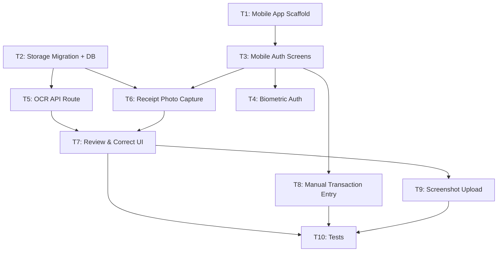

# Implementation Plan: Phase 2 — AI Magic (Mobile App + Receipt OCR)

## Executive Summary

Build the Phase 2 "AI Magic" features: scaffold the React Native + Expo mobile app (`apps/mobile`) with authentication, biometric login, and manual transaction entry; then implement the full receipt OCR pipeline — camera capture, a Next.js API route calling Claude 3.5 Sonnet vision, and a mobile review/correction UI. 10 tasks, 33 estimated hours.

### Key Technical Decisions

| Decision | Rationale |
|----------|-----------|
| Next.js API route for OCR | User's own Anthropic API key; keeps AI billing in web backend; easier to test |
| Expo Router (file-based navigation) | Mirrors Next.js App Router — same team mental model |
| NativeWind v4 for styling | Same Tailwind utility classes as the web app (`zinc` palette) |
| Upload-first pipeline | Mobile uploads to Supabase Storage → sends signed URL to OCR route — no raw binary in API request |
| `expo-secure-store` for auth tokens | Secure JWT storage; Expo-recommended pattern for Supabase on RN |

### Risk Factors

| Risk | Mitigation |
|------|------------|
| pnpm hoisting conflicts with Metro bundler | `node-linker=hoisted` in `apps/mobile/.npmrc` — test in T1 |
| Claude latency > 10s | 25s abort timeout on API route; client shows retry prompt |
| Polish receipt abbreviations | Prompt in T5 includes Biedronka/Żabka examples; spike during T5 |
| Supabase Storage RLS | Private bucket, per-user path prefix `receipts/{user_id}/`; verified in checklist |
| Mobile auth token → Next.js API | Mobile sends `Authorization: Bearer <access_token>`; route validates via service client |

---

## Source Traceability

| Field | Value |
|-------|-------|
| **Stories** | US-003, US-005, US-010, US-011, US-012, US-013 |
| **Phase** | Phase 2 — AI Magic |
| **Priority** | P0-Critical (OCR core), P1-High (biometric, screenshot) |

### Acceptance Criteria Mapping

| AC | Summary | Task(s) |
|----|---------|---------|
| US-010 AC-1/2/3/4 | Camera + gallery + blurry warning | T6 |
| US-011 AC-1 | All line items extracted (name/qty/price + store + total) | T5, T7 |
| US-011 AC-2 | Loading indicator; results within 10s | T6, T7 |
| US-011 AC-3 | Automatic category mapping | T5 |
| US-011 AC-4/5 | Low-confidence flags; Polish names preserved | T5, T7 |
| US-012 AC-1/2/3/4 | Edit/delete/add items; save as transactions | T7 |
| US-013 AC-1/2 | Screenshot from gallery → same pipeline | T9 |
| US-003 AC-1/2/3 | Biometric prompt; FaceID/TouchID unlock; password fallback | T4 |
| US-005 AC-1/2/3 | Mobile manual entry form; syncs to web within 5s | T8 |

---

## Codebase Conventions

| Convention | Pattern |
|------------|---------|
| Server action errors (web) | `{ fieldErrors }` for validation, `{ error: '...' }` for DB/auth — no raw `error.message` to client |
| API route auth | Extract `Authorization: Bearer` header → `supabase.auth.getUser(token)` via service client |
| Supabase clients (web) | `createBrowserClient` in `'use client'`; `createServerClient` via `next/headers` in Server Components. Route Handlers re-init from request cookies |
| TypeScript types | Three-tier per table: `Row`, `Insert`, `Update`; top-level `Database` interface |
| Tailwind (web) | v4 CSS-only config; `@theme inline {}` in `globals.css`; no `tailwind.config.js` |
| NativeWind (mobile) | v4 with `withNativeWind` babel wrapper; same utility classes as web |
| File naming | Components: PascalCase; hooks/actions/utils: camelCase; routes: framework conventions |
| Env vars | `NEXT_PUBLIC_*` for browser, no prefix for server-only. `ANTHROPIC_API_KEY` — no `NEXT_PUBLIC_` prefix ever |
| Mobile imports | Absolute via `@/*` alias; no barrel `index.ts` files (Metro dislikes them) |
| Testing | Playwright E2E (Chromium, sequential). Vitest unit tests added in T10 (first time) |

---

## Execution Strategy

| Wave | Tasks | Hours | Description |
|------|-------|-------|-------------|
| 1 | T1, T2 | 3h + 2h | Mobile scaffold + DB migration (fully parallel) |
| 2 | T3, T5 | 4h + 4h | Mobile auth + OCR API route (parallel — T3 needs T1, T5 needs T2) |
| 3 | T4, T6, T8 | 3h + 4h + 3h | Biometric auth + receipt capture + manual entry (all depend on Wave 2) |
| 4 | T7 | 5h | Review & correct UI (depends on T5 + T6) |
| 5 | T9 | 2h | Screenshot upload (depends on T7 pipeline) |
| 6 | T10 | 3h | Tests + API verification (depends on T7 + T8 + T9) |

**Total estimated hours**: 33h
**Critical path**: T1 → T3 → T6 → T7 → T9 → T10 (21h)

---

## Task Breakdown

### Task 1: Mobile App Scaffold (Expo + pnpm workspace)

**What to do**: Create `apps/mobile` as an Expo SDK 52 + TypeScript app with Expo Router navigation, NativeWind v4 styling, and Supabase JS client. Wire it into the pnpm/Turbo monorepo and set up the root tab navigator shell.

**Key steps**:
- `npx create-expo-app@latest mobile --template blank-typescript` → move to `apps/mobile/`
- Add `node-linker=hoisted` to `apps/mobile/.npmrc` to fix Metro/pnpm conflicts
- Install NativeWind v4, configure `babel.config.js` and `global.css`
- Create `apps/mobile/lib/supabase.ts` using `createClient` with `expo-secure-store` adapter
- Add `EXPO_PUBLIC_SUPABASE_URL`, `EXPO_PUBLIC_SUPABASE_ANON_KEY`, `EXPO_PUBLIC_API_BASE_URL` to `.env.example`
- Add `start` task to `turbo.json`

| | |
|---|---|
| **Estimated Hours** | 3h |
| **Dependencies** | None |
| **Blocks** | T3 |
| **Files** | `apps/mobile/package.json` (Create), `apps/mobile/app.json` (Create), `apps/mobile/tsconfig.json` (Create), `apps/mobile/.npmrc` (Create), `apps/mobile/.env.example` (Create), `apps/mobile/app/_layout.tsx` (Create), `apps/mobile/app/(tabs)/_layout.tsx` (Create), `apps/mobile/app/(tabs)/index.tsx` (Create), `apps/mobile/lib/supabase.ts` (Create), `turbo.json` (Modify) |
| **Linked AC** | Foundation for all Phase 2 stories |

---

### Task 2: Supabase Storage Migration + DB Schema Update

**What to do**: Create migration `003` to add a private `receipts` Storage bucket with per-user RLS policies and add `receipt_url TEXT NULL` to the `transactions` table. Update `apps/web/types/database.ts` with the new field.

**Key steps**:
- `003_receipt_storage.sql`: `ALTER TABLE transactions ADD COLUMN receipt_url TEXT`; create private `receipts` bucket; add Storage RLS policies scoped to `auth.uid()::text = (storage.foldername(name))[1]`
- Write `003_receipt_storage_down.sql` rollback
- Add `receipt_url: string | null` to `TransactionRow`, `TransactionInsert` in `types/database.ts`

| | |
|---|---|
| **Estimated Hours** | 2h |
| **Dependencies** | None |
| **Blocks** | T5, T6 |
| **Files** | `supabase/migrations/003_receipt_storage.sql` (Create), `supabase/migrations/003_receipt_storage_down.sql` (Create), `apps/web/types/database.ts` (Modify) |
| **Linked AC** | US-011 NFR (private Storage) |

---

### Task 3: Mobile Authentication Screens

**What to do**: Build login and register screens for mobile using the existing Supabase auth backend. Create `AuthContext` for session state, navigation guards, and `KeyboardAvoidingView`-wrapped forms.

**Key steps**:
- `AuthContext`: wraps `supabase.auth.onAuthStateChange`, exposes `{ session, user, loading, signOut }`
- Root `_layout.tsx`: navigation guard — push to `/(auth)/login` if no session on a protected route
- `login.tsx`: email + password fields, call `signInWithPassword`, show inline errors
- `register.tsx`: mirrors web registration; show "Check your email" on success (no auto-redirect)
- Use `KeyboardAvoidingView` + NativeWind classes matching web zinc palette

| | |
|---|---|
| **Estimated Hours** | 4h |
| **Dependencies** | T1 |
| **Blocks** | T4, T6, T8 |
| **Files** | `apps/mobile/context/AuthContext.tsx` (Create), `apps/mobile/app/(auth)/_layout.tsx` (Create), `apps/mobile/app/(auth)/login.tsx` (Create), `apps/mobile/app/(auth)/register.tsx` (Create), `apps/mobile/app/_layout.tsx` (Modify) |
| **Linked AC** | Foundation for US-003, US-005, US-010 |

---

### Task 4: Mobile Biometric Authentication (US-003)

**What to do**: Use `expo-local-authentication` to offer FaceID/TouchID after first login. Store preference in `expo-secure-store`, prompt on each app open, and fall back to password if biometric fails or is unavailable.

**Key steps**:
- `useBiometric` hook: `hasHardwareAsync()` + `isEnrolledAsync()` to check availability; `authenticateAsync({ promptMessage: 'Unlock Finance Lifestyle OS', fallbackLabel: 'Use Password' })`
- `SecureStore.setItemAsync('biometric_enabled', 'true')` to persist opt-in
- Show `biometric-setup.tsx` after first login if hardware available; skip silently if not
- `AppState` listener in root layout: re-prompt after > 5 minutes in background

| | |
|---|---|
| **Estimated Hours** | 3h |
| **Dependencies** | T3 |
| **Blocks** | T10 |
| **Files** | `apps/mobile/hooks/useBiometric.ts` (Create), `apps/mobile/app/(auth)/biometric-setup.tsx` (Create), `apps/mobile/app/_layout.tsx` (Modify) |
| **Linked AC** | US-003 AC-1, AC-2, AC-3 |

---

### Task 5: OCR API Route (Claude 3.5 Sonnet Vision)

**What to do**: Create `POST /api/receipts/parse` in the Next.js web app. Validates the mobile caller's Bearer token, downloads the receipt image from Supabase Storage, calls Claude 3.5 Sonnet vision with a Polish-optimized prompt, validates the response with Zod, and returns structured JSON.

**Key steps**:
- `pnpm add @anthropic-ai/sdk` in `apps/web`; add `ANTHROPIC_API_KEY=` to `.env.local.example`
- Auth: `Authorization: Bearer` → `supabaseAdmin.auth.getUser(token)` → 401 if invalid
- Image fetch: `storage.createSignedUrl(storagePath, 60)` → fetch → base64 encode
- `parseReceiptPrompt.ts`: system prompt with Polish retailer abbreviations, closed category list (12 categories), explicit JSON schema, `confidence: 'high' | 'low'` per item
- `receiptSchema.ts`: Zod schema for `ParsedReceiptSchema`; safeParse Claude's text response
- Discrepancy check: if `|sum(items.total_price) - receipt.total| > 1.0`, set `discrepancy_warning: true`
- Error codes: `UNAUTHENTICATED (401)`, `PARSE_FAILED (500)`, `NO_ITEMS_FOUND (422)`, `TIMEOUT (504)`
- 25s `AbortSignal.timeout` on the Anthropic fetch

| | |
|---|---|
| **Estimated Hours** | 4h |
| **Dependencies** | T2 |
| **Blocks** | T7 |
| **Files** | `apps/web/app/api/receipts/parse/route.ts` (Create), `apps/web/lib/ocr/parseReceiptPrompt.ts` (Create), `apps/web/lib/ocr/receiptSchema.ts` (Create), `apps/web/.env.local.example` (Modify), `apps/web/next.config.ts` (Modify) |
| **Linked AC** | US-011 AC-1, AC-2, AC-3, AC-4, AC-5; US-013 AC-2 |

---

### Task 6: Receipt Photo Capture (US-010)

**What to do**: Build the mobile camera screen using `expo-camera`, a preview/retake flow, and gallery picker via `expo-image-picker`. Compress images to < 2MB with `expo-image-manipulator`, upload to Supabase Storage, call the OCR route, and navigate to the review screen.

**Key steps**:
- `useCameraPermissions()` gate — show permission request screen if denied
- `CameraView` with `ref.takePictureAsync({ quality: 0.8 })` for capture
- `launchImageLibraryAsync` for gallery (and screenshot) alternatives
- `receiptUpload.ts`: compress → `storage.from('receipts').upload(...)` → get access token → `POST /api/receipts/parse` with Bearer header
- Loading overlay: "Reading your receipt…" with `ActivityIndicator` while OCR runs
- On success: `router.push({ pathname: '/(review)/review', params: { receiptJson, storagePath } })`
- On `confidence: 'low'` top-level: show banner "Receipt may be hard to read" (user can proceed)

| | |
|---|---|
| **Estimated Hours** | 4h |
| **Dependencies** | T2, T3 |
| **Blocks** | T7 |
| **Files** | `apps/mobile/app/(camera)/_layout.tsx` (Create), `apps/mobile/app/(camera)/capture.tsx` (Create), `apps/mobile/app/(camera)/preview.tsx` (Create), `apps/mobile/lib/receiptUpload.ts` (Create), `apps/mobile/app/(tabs)/index.tsx` (Modify) |
| **Linked AC** | US-010 AC-1, AC-2, AC-3, AC-4; US-011 AC-2 |

---

### Task 7: Review & Correct Parsed Receipt UI (US-012)

**What to do**: Build the review screen that renders extracted line items in an editable list — with inline edit, swipe-delete, add-missing-item modal, low-confidence warnings, total discrepancy banner — then saves all items as individual `ocr`-sourced transactions.

**Key steps**:
- Receive `receiptJson` + `storagePath` as Expo Router params; init `useState<ReviewItem[]>`
- Inline edit: tap row → TextInput fields for name/price; category via modal picker; auto-recalculate `total`
- Delete: `Alert.alert` confirm → filter item from state
- `AddItemModal`: bottom modal with same fields as inline edit, "Add" appends to list
- Low-confidence items: sorted first; ⚠️ yellow icon from `@expo/vector-icons/Ionicons`
- Discrepancy banner: shown if `parsed.discrepancy_warning === true`
- Save: `saveReceipt(items, receipt, storagePath, userId)` → bulk insert transactions with `transaction_source: 'ocr'` and `receipt_url: storagePath`
- After save: `router.replace('/(tabs)')` (prevents back-nav to review); show toast

| | |
|---|---|
| **Estimated Hours** | 5h |
| **Dependencies** | T5, T6 |
| **Blocks** | T9, T10 |
| **Files** | `apps/mobile/app/(review)/_layout.tsx` (Create), `apps/mobile/app/(review)/review.tsx` (Create), `apps/mobile/components/receipt/ReceiptItem.tsx` (Create), `apps/mobile/components/receipt/AddItemModal.tsx` (Create), `apps/mobile/lib/actions/saveReceipt.ts` (Create), `apps/mobile/types/receipt.ts` (Create) |
| **Linked AC** | US-012 AC-1, AC-2, AC-3, AC-4; US-011 AC-1, AC-4 |

---

### Task 8: Mobile Manual Transaction Entry (US-005)

**What to do**: Build the mobile transactions list and new transaction form — mirroring the web `TransactionForm` using React Native components. Includes Realtime subscription so transactions appear in the web app within 5 seconds.

**Key steps**:
- `useTransactions` hook: initial fetch + `postgres_changes` Realtime subscription (INSERT/DELETE events)
- `useCategories` hook: fetch categories for picker
- `TransactionForm`: amount (`decimal-pad` keyboard), merchant (text), category (`Picker`), date (`DateTimePicker`), note (optional)
- Save: `supabase.from('transactions').insert(...)` with `transaction_source: 'manual'`
- After save: `router.back()` — Realtime updates the list automatically

| | |
|---|---|
| **Estimated Hours** | 3h |
| **Dependencies** | T3 |
| **Blocks** | T10 |
| **Files** | `apps/mobile/app/(tabs)/transactions.tsx` (Create), `apps/mobile/app/transactions/new.tsx` (Create), `apps/mobile/components/transactions/TransactionForm.tsx` (Create), `apps/mobile/hooks/useTransactions.ts` (Create), `apps/mobile/hooks/useCategories.ts` (Create) |
| **Linked AC** | US-005 AC-1, AC-2, AC-3; US-008 AC-1 |

---

### Task 9: Digital Receipt Screenshot Upload (US-013)

**What to do**: Expose a "Upload Receipt Screenshot" option on the home FAB action sheet. It uses the gallery picker (no camera) and feeds into the same upload + OCR + review pipeline built in T6/T7. No new backend code required.

**Key steps**:
- Replace home FAB `onPress` with an `ActionSheetIOS` / `Alert` action sheet: "Take Photo" | "Upload from Gallery" | "Upload Receipt Screenshot" | "Cancel"
- All three options navigate to `/(camera)/capture` with a `?mode=` param (`camera`, `gallery`, `screenshot`)
- In `capture.tsx`: switch on `mode` param — `camera` opens `CameraView`, `gallery`/`screenshot` call `launchImageLibraryAsync` with `allowsEditing: false`
- Same upload + parse + review flow as T6

| | |
|---|---|
| **Estimated Hours** | 2h |
| **Dependencies** | T7 |
| **Blocks** | T10 |
| **Files** | `apps/mobile/app/(tabs)/index.tsx` (Modify), `apps/mobile/app/(camera)/capture.tsx` (Modify) |
| **Linked AC** | US-013 AC-1, AC-2 |

---

### Task 10: Tests + API Route Verification

**What to do**: Add Vitest unit tests for the OCR API route (first unit test framework in the project), Playwright tests verifying auth rejection, and a manual test checklist for the full mobile OCR flow covering accuracy and latency targets.

**Key steps**:
- `pnpm add -D vitest @vitest/coverage-v8` in `apps/web`; create `vitest.config.ts`
- Add `"test:unit": "vitest run"` to `apps/web/package.json`
- Unit tests: mock Anthropic SDK + Supabase; test 401, PARSE_FAILED, discrepancy_warning
- Playwright `ocr-api.spec.ts`: test 401 for missing/invalid Bearer token against live dev server
- Manual test checklist in `__tests__/e2e/README-mobile.md`: Biedronka paper receipt (≥10 items), Żabka digital screenshot, blurry receipt, 2-tab Realtime sync

| | |
|---|---|
| **Estimated Hours** | 3h |
| **Dependencies** | T7, T8, T9 |
| **Blocks** | None |
| **Files** | `apps/web/vitest.config.ts` (Create), `apps/web/__tests__/api/receipts-parse.test.ts` (Create), `apps/web/__tests__/e2e/ocr-api.spec.ts` (Create), `apps/web/package.json` (Modify) |
| **Linked AC** | US-011 NFR (90% accuracy, 10s latency) |

---

## Dependency Graph

---

## File Changes Summary

### Files to Create (37 total)

| File Path | Purpose | Task |
|-----------|---------|------|
| `apps/mobile/package.json` | Mobile workspace package | T1 |
| `apps/mobile/app.json` | Expo config | T1 |
| `apps/mobile/tsconfig.json` | TypeScript config for mobile | T1 |
| `apps/mobile/.npmrc` | Metro/pnpm hoisting fix | T1 |
| `apps/mobile/.env.example` | Mobile env vars template | T1 |
| `apps/mobile/app/_layout.tsx` | Root Expo Router layout | T1 |
| `apps/mobile/app/(tabs)/_layout.tsx` | Bottom tab navigator | T1 |
| `apps/mobile/app/(tabs)/index.tsx` | Home screen | T1 |
| `apps/mobile/lib/supabase.ts` | Supabase client for RN | T1 |
| `supabase/migrations/003_receipt_storage.sql` | Storage bucket + receipt_url column | T2 |
| `supabase/migrations/003_receipt_storage_down.sql` | Rollback migration | T2 |
| `apps/mobile/context/AuthContext.tsx` | Auth React context | T3 |
| `apps/mobile/app/(auth)/_layout.tsx` | Auth stack layout | T3 |
| `apps/mobile/app/(auth)/login.tsx` | Login screen | T3 |
| `apps/mobile/app/(auth)/register.tsx` | Register screen | T3 |
| `apps/mobile/hooks/useBiometric.ts` | Biometric hook | T4 |
| `apps/mobile/app/(auth)/biometric-setup.tsx` | Biometric setup screen | T4 |
| `apps/web/app/api/receipts/parse/route.ts` | Claude OCR API route | T5 |
| `apps/web/lib/ocr/parseReceiptPrompt.ts` | Claude prompt template | T5 |
| `apps/web/lib/ocr/receiptSchema.ts` | Zod schema for parsed receipt | T5 |
| `apps/mobile/app/(camera)/_layout.tsx` | Camera stack layout | T6 |
| `apps/mobile/app/(camera)/capture.tsx` | Camera capture screen | T6 |
| `apps/mobile/app/(camera)/preview.tsx` | Photo preview screen | T6 |
| `apps/mobile/lib/receiptUpload.ts` | Upload + parse helpers | T6 |
| `apps/mobile/app/(review)/_layout.tsx` | Review stack layout | T7 |
| `apps/mobile/app/(review)/review.tsx` | Review screen | T7 |
| `apps/mobile/components/receipt/ReceiptItem.tsx` | Line item row component | T7 |
| `apps/mobile/components/receipt/AddItemModal.tsx` | Add item modal | T7 |
| `apps/mobile/lib/actions/saveReceipt.ts` | Save receipt as transactions | T7 |
| `apps/mobile/types/receipt.ts` | Receipt type definitions | T7 |
| `apps/mobile/app/(tabs)/transactions.tsx` | Transactions list screen | T8 |
| `apps/mobile/app/transactions/new.tsx` | New transaction form | T8 |
| `apps/mobile/components/transactions/TransactionForm.tsx` | Transaction form component | T8 |
| `apps/mobile/hooks/useTransactions.ts` | Transactions hook + Realtime | T8 |
| `apps/mobile/hooks/useCategories.ts` | Categories hook | T8 |
| `apps/web/vitest.config.ts` | Vitest unit test config | T10 |
| `apps/web/__tests__/api/receipts-parse.test.ts` | OCR route unit tests | T10 |
| `apps/web/__tests__/e2e/ocr-api.spec.ts` | Playwright API auth tests | T10 |

### Files to Modify (8 total)

| File Path | Changes | Task |
|-----------|---------|------|
| `apps/web/types/database.ts` | Add `receipt_url` field | T2 |
| `apps/web/.env.local.example` | Add `ANTHROPIC_API_KEY=` | T5 |
| `apps/web/next.config.ts` | Add Supabase Storage `remotePatterns` | T5 |
| `apps/mobile/app/_layout.tsx` | Add AuthProvider + nav guard | T3 |
| `apps/mobile/app/_layout.tsx` | Add biometric challenge logic | T4 |
| `apps/mobile/app/(camera)/capture.tsx` | Add screenshot upload mode | T9 |
| `apps/mobile/app/(tabs)/index.tsx` | Add action sheet for FAB | T9 |
| `apps/web/package.json` | Add `test:unit` vitest script | T10 |
| `turbo.json` | Add `start` task for Expo | T1 |

### Database Changes

| Migration | Rollback | Description | Task |
|-----------|----------|-------------|------|
| `003_receipt_storage.sql` | `003_receipt_storage_down.sql` | Storage bucket + receipt_url column + RLS | T2 |

---

## Implementation Checklist

### Before Starting
- [ ] Supabase project has Storage enabled
- [ ] `ANTHROPIC_API_KEY` obtained and added to `apps/web/.env.local`
- [ ] Expo Go or development build available on test device
- [ ] Migration `003` applied (`supabase db push`)
- [ ] `EXPO_PUBLIC_API_BASE_URL` set to local Next.js server IP (e.g. `http://192.168.x.x:3000` for device)

### Task Progress
- [ ] T1 complete — `apps/mobile` runs in Expo Go
- [ ] T2 complete — migration applied, `receipt_url` column exists, types compile
- [ ] T3 complete — mobile login/register works, auth guard redirects correctly
- [ ] T4 complete — biometric prompt appears, FaceID/TouchID unlocks app
- [ ] T5 complete — `/api/receipts/parse` returns structured JSON for a real receipt
- [ ] T6 complete — photo captured, uploaded, OCR called, navigates to review
- [ ] T7 complete — items editable/saveable, appear in web app
- [ ] T8 complete — manual transaction from mobile appears in web within 5s
- [ ] T9 complete — gallery screenshot parses through same pipeline
- [ ] T10 complete — unit + E2E tests passing

### Before Code Review
- [ ] `npx tsc --noEmit` zero errors (both `apps/web` and `apps/mobile`)
- [ ] `pnpm lint` zero warnings in both apps
- [ ] RLS verified: user A cannot access user B's Storage files
- [ ] OCR accuracy tested: ≥ 90% on ≥ 10 real Polish receipts
- [ ] End-to-end latency < 10s P90 on device over WiFi
- [ ] `ANTHROPIC_API_KEY` absent from client bundle (`pnpm build` check)

---

## Metadata

| Field | Value |
|-------|-------|
| **Plan ID** | IP-20260402-002 |
| **Source** | US-003, US-005, US-010, US-011, US-012, US-013 (Phase 2 — AI Magic) |
| **Created** | 2026-04-02 |
| **Author** | code-craftsman |
| **Status** | Draft |
| **Total Estimated Hours** | 33h |
| **Full Plan** | `docs/implementation-plans/IP-20260402-002-full.md` |

---

## Revision History

| Version | Date | Author | Changes |
|---------|------|--------|---------|
| 1.0 | 2026-04-02 | code-craftsman | Initial plan — Phase 2 AI Magic |
