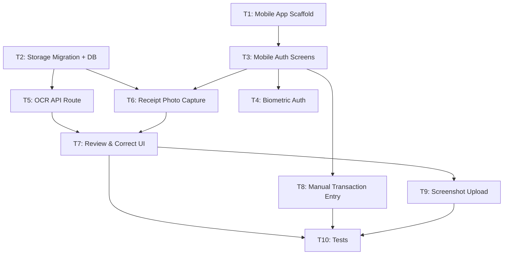
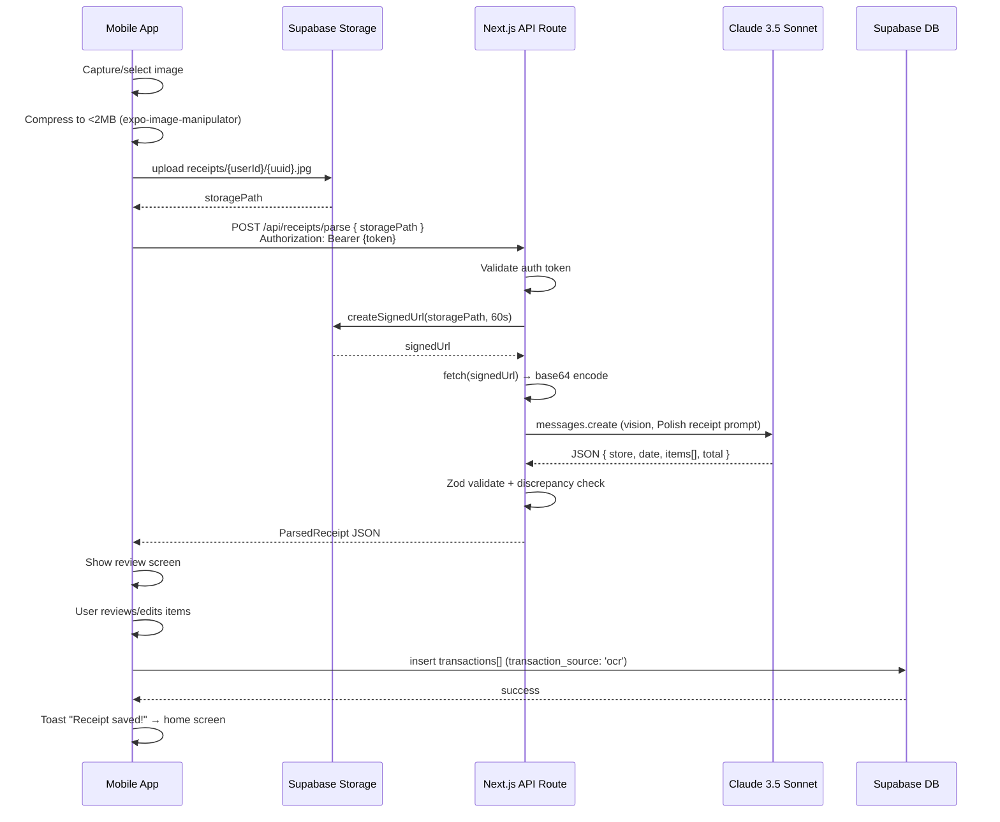

# Implementation Plan: Phase 2 — AI Magic (Mobile App + Receipt OCR)

## Executive Summary

Build the Phase 2 "AI Magic" features for Finance Lifestyle OS: scaffold the React Native + Expo mobile app (`apps/mobile`) with authentication and basic transaction entry, then implement the full receipt OCR pipeline — mobile photo capture, a Next.js API route calling Claude 3.5 Sonnet vision, and a mobile review/correction UI. 10 tasks, 33 estimated hours.

### Key Technical Decisions

| Decision | Rationale |
|----------|-----------|
| Next.js API route for OCR (not Supabase Edge Function) | User's own Anthropic API key; keeps AI billing centralized in web backend; easier to test and iterate |
| Expo Router (file-based navigation) | Mirrors Next.js App Router mental model; same team; enables deep linking; official Expo recommendation |
| NativeWind v4 for styling | Tailwind utility classes on native components — same class vocabulary as the web app (`zinc` palette already in use) |
| Upload-first pipeline | Mobile uploads image to Supabase Storage → sends signed URL to OCR route → avoids sending raw binary to API route |
| `@supabase/supabase-js` + AsyncStorage on mobile | Official Supabase pattern for React Native; session persists across app restarts |
| `expo-secure-store` for auth tokens | More secure than AsyncStorage for JWTs; Expo-recommended |

### Risk Factors

| Risk | Mitigation |
|------|------------|
| pnpm hoisting conflicts with Metro bundler | Add `node-linker=hoisted` in `apps/mobile/.npmrc`; test early in T1 |
| Anthropic API latency > 10s on slow receipts | Streaming not needed; P90 target is 10s; P99 20s. Add a 25s timeout on the API route and surface a retry prompt |
| Polish receipt abbreviations confusing Claude | Prompt engineering in T5 includes examples of Biedronka/Żabka abbreviations; spike in T5 before full UI work |
| Supabase Storage RLS complexity | Private bucket with per-user path prefix (`receipts/{user_id}/`); RLS policy scoped to `auth.uid()` path match |
| Mobile auth token passing to Next.js API route | Mobile sends `Authorization: Bearer <access_token>` header; API route validates via Supabase service client |

---

## Source Traceability

| Field | Value |
|-------|-------|
| **Stories** | US-003, US-005, US-010, US-011, US-012, US-013 |
| **Phase** | Phase 2 — AI Magic |
| **Total Story Points** | 21 pts (3+3+3+8+5+2) |
| **Priority** | P0-Critical (OCR core), P1-High (biometric, screenshot) |

### Acceptance Criteria Mapping

| AC | Summary | Task(s) |
|----|---------|---------|
| US-010 AC-1 | Camera opens within app | T6 |
| US-010 AC-2 | Photo captured + preview with retake/confirm | T6 |
| US-010 AC-3 | Gallery upload alternative | T6, T9 |
| US-010 AC-4 | Blurry photo warning | T6 |
| US-011 AC-1 | All line items extracted with name/qty/price + store + total | T5, T7 |
| US-011 AC-2 | Loading indicator; results within 10s | T6, T7 |
| US-011 AC-3 | Automatic category mapping per item | T5 |
| US-011 AC-4 | Low-confidence items flagged with warning icon | T5, T7 |
| US-011 AC-5 | Polish product names preserved + correctly categorized | T5 |
| US-012 AC-1 | Edit line item (name, price, category) + recalculate total | T7 |
| US-012 AC-2 | Delete incorrect line item + recalculate | T7 |
| US-012 AC-3 | Add missing line item manually | T7 |
| US-012 AC-4 | Save all items as transactions → toast → home screen | T7 |
| US-013 AC-1 | Screenshot selected from gallery → same parse pipeline | T9 |
| US-013 AC-2 | Żabka/Biedronka app screenshots recognized | T5, T9 |
| US-003 AC-1 | Biometric prompt on app open after login | T4 |
| US-003 AC-2 | FaceID/TouchID unlocks session without password | T4 |
| US-003 AC-3 | Fallback to password if biometric unavailable | T4 |
| US-005 AC-1 | Manual transaction form on mobile | T8 |
| US-005 AC-2 | Category select, amount, date, merchant, note | T8 |
| US-005 AC-3 | Transaction visible in web app within 5s | T8 |

---

## Codebase Conventions

| Convention | Pattern | Example Reference |
|------------|---------|-------------------|
| Server action errors | Return `{ fieldErrors }` for validation, `{ error: '...' }` for DB/auth failures — never raw Supabase `error.message` to client | `apps/web/lib/actions/transactions.ts` |
| Server action auth | Always call `supabase.auth.getUser()` — never trust client-supplied `user_id` | `apps/web/lib/actions/auth.ts` |
| Supabase clients (web) | `createBrowserClient` in `'use client'` hooks; `createServerClient` in `'use server'` actions and Server Components | `apps/web/lib/supabase/client.ts`, `server.ts` |
| API route Supabase client | Must re-init from `NextRequest` cookies — cannot use `next/headers`-based `server.ts` | `apps/web/app/auth/callback/route.ts` |
| TypeScript types | Three-tier per table (`Row`, `Insert`, `Update`); top-level `Database` interface; re-exported aliases | `apps/web/types/database.ts` |
| Tailwind (web) | v4, CSS-only config via `@theme inline {}` in `globals.css`; `@tailwindcss/postcss` plugin only — no `tailwind.config.js` | `apps/web/app/globals.css` |
| NativeWind (mobile) | v4, wraps NativeWind provider around root; same utility classes as web (`zinc`, `slate` palette) | New in T1 |
| File naming (web) | Components: PascalCase; actions/hooks/utils: camelCase; routes: Next.js conventions | `apps/web/components/`, `lib/actions/` |
| File naming (mobile) | Screens in `app/` (Expo Router); components in `components/`; hooks in `hooks/`; lib in `lib/` | New in T1 |
| Path alias | `@/*` → `apps/web/` root (tsconfig). Mobile will use its own `@/*` → `apps/mobile/` | `apps/web/tsconfig.json` |
| Imports (mobile) | Absolute via `@/*` alias; no barrel `index.ts` files (Expo Metro dislikes them) | New in T1 |
| Environment vars | `NEXT_PUBLIC_*` for browser; no prefix for server-only. `ANTHROPIC_API_KEY` must NEVER have `NEXT_PUBLIC_` | `apps/web/.env.local.example` |
| Testing | Playwright E2E (Chromium only, sequential, `workers: 1`); no unit test framework yet | `apps/web/playwright.config.ts` |
| Error boundaries | Not yet used — add `ErrorBoundary` in mobile root layout | New in T1 |

---

## Execution Strategy

| Wave | Tasks | Hours | Description |
|------|-------|-------|-------------|
| 1 | T1, T2 | 3h + 2h | Mobile scaffold + DB migration (fully parallel) |
| 2 | T3, T5 | 4h + 4h | Mobile auth screens + OCR API route (parallel — T3 needs T1, T5 needs T2) |
| 3 | T4, T6, T8 | 3h + 4h + 3h | Biometric auth + receipt capture + manual entry (parallel — all depend on T3 or T2) |
| 4 | T7 | 5h | Review & correct UI (depends on T5 + T6) |
| 5 | T9 | 2h | Digital screenshot upload (depends on T7 pipeline) |
| 6 | T10 | 3h | Tests + API route verification (depends on T7 + T8 + T9) |

**Total estimated hours**: 33h
**Critical path**: T1 → T3 → T6 → T7 → T9 → T10 (21h)

---

## Task Breakdown

### Task 1: Mobile App Scaffold (Expo + pnpm workspace)

**Description**: Create `apps/mobile` as an Expo SDK 52 app with TypeScript, Expo Router, NativeWind v4, and Supabase JS client. Integrate into the pnpm monorepo, verify Turbo can run `dev` and `build` for mobile, and set up the root tab navigator shell.

**Estimated Hours**: 3h

**Dependencies**: None

**Blocks**: T3

**Files**:
| File | Action | Description |
|------|--------|-------------|
| `apps/mobile/package.json` | Create | Expo workspace package with `"name": "mobile"` |
| `apps/mobile/app.json` | Create | Expo config (slug, icon, splash) |
| `apps/mobile/tsconfig.json` | Create | TypeScript config extending base; `@/*` alias → `./` |
| `apps/mobile/.npmrc` | Create | `node-linker=hoisted` to fix Metro pnpm conflicts |
| `apps/mobile/app/_layout.tsx` | Create | Root Expo Router layout with NativeWind provider, auth guard |
| `apps/mobile/app/(tabs)/_layout.tsx` | Create | Bottom tab navigator (Home, Transactions, Settings) |
| `apps/mobile/app/(tabs)/index.tsx` | Create | Home screen placeholder |
| `apps/mobile/lib/supabase.ts` | Create | Supabase client for React Native using AsyncStorage + SecureStore |
| `apps/mobile/.env.example` | Create | `EXPO_PUBLIC_SUPABASE_URL`, `EXPO_PUBLIC_SUPABASE_ANON_KEY`, `EXPO_PUBLIC_API_BASE_URL` |
| `turbo.json` | Modify | Add `start` task for Expo |

**Implementation Notes**:
- Use `npx create-expo-app@latest mobile --template blank-typescript` as starting point, then move into `apps/mobile/`
- Expo Router requires `"main": "expo-router/entry"` in `package.json` and `"scheme"` in `app.json`
- NativeWind v4 requires `withNativeWind` wrapper in `babel.config.js` and a `global.css` with `@import "nativewind/stylesheet"`
- Supabase React Native client needs `react-native-url-polyfill` imported at the top of `lib/supabase.ts`
- `expo-secure-store` replaces localStorage for token persistence: pass as `storage` option to `createClient`
- `EXPO_PUBLIC_*` is Expo's equivalent of `NEXT_PUBLIC_*` — safe to bundle in client
- `EXPO_PUBLIC_API_BASE_URL` = `http://localhost:3000` in dev; the Next.js app URL in production

**Linked Acceptance Criteria**: Foundation for all Phase 2 user stories

**Verify**:
```bash
cd apps/mobile
pnpm install
npx expo export --platform ios 2>&1 | tail -5  # Should exit 0, no TS errors
npx tsc --noEmit
```

**Code Scaffold**:

```typescript
// apps/mobile/lib/supabase.ts  [Create — full scaffold]
import 'react-native-url-polyfill/auto'
import { createClient } from '@supabase/supabase-js'
import * as SecureStore from 'expo-secure-store'

const ExpoSecureStoreAdapter = {
  getItem: (key: string) => SecureStore.getItemAsync(key),
  setItem: (key: string, value: string) => SecureStore.setItemAsync(key, value),
  removeItem: (key: string) => SecureStore.deleteItemAsync(key),
}

const supabaseUrl = process.env.EXPO_PUBLIC_SUPABASE_URL!
const supabaseAnonKey = process.env.EXPO_PUBLIC_SUPABASE_ANON_KEY!

export const supabase = createClient(supabaseUrl, supabaseAnonKey, {
  auth: {
    storage: ExpoSecureStoreAdapter,
    autoRefreshToken: true,
    persistSession: true,
    detectSessionInUrl: false,
  },
})
```

```typescript
// apps/mobile/app/_layout.tsx  [Create — full scaffold]
import { useEffect } from 'react'
import { Stack } from 'expo-router'
import { supabase } from '@/lib/supabase'
import { useRouter, useSegments } from 'expo-router'

export default function RootLayout() {
  const router = useRouter()
  const segments = useSegments()

  useEffect(() => {
    // TODO: Subscribe to supabase.auth.onAuthStateChange
    // TODO: If no session and not on (auth) route, redirect to /login
    // TODO: If session exists and on (auth) route, redirect to /(tabs)
    // TODO: Unsubscribe on cleanup
  }, [router, segments])

  return (
    <Stack screenOptions={{ headerShown: false }}>
      <Stack.Screen name="(auth)" />
      <Stack.Screen name="(tabs)" />
    </Stack>
  )
}
```

```typescript
// apps/mobile/app/(tabs)/_layout.tsx  [Create — full scaffold]
import { Tabs } from 'expo-router'

export default function TabsLayout() {
  return (
    <Tabs screenOptions={{ tabBarActiveTintColor: '#3b82f6' }}>
      <Tabs.Screen name="index" options={{ title: 'Home' }} />
      {/* TODO: Add Transactions and Settings tabs */}
    </Tabs>
  )
}
```

```json
// apps/mobile/.npmrc  [Create]
node-linker=hoisted
```

---

### Task 2: Supabase Storage Migration + DB Schema Update

**Description**: Create migration `003` to add a private `receipts` Supabase Storage bucket with per-user RLS, add `receipt_url` column to the `transactions` table, and update the TypeScript database types in the web app.

**Estimated Hours**: 2h

**Dependencies**: None

**Blocks**: T5, T6

**Files**:
| File | Action | Description |
|------|--------|-------------|
| `supabase/migrations/003_receipt_storage.sql` | Create | Storage bucket + receipts bucket RLS + receipt_url column |
| `supabase/migrations/003_receipt_storage_down.sql` | Create | Rollback: drop column + policies + bucket |
| `apps/web/types/database.ts` | Modify | Add `receipt_url` to `TransactionRow`, `TransactionInsert`, `TransactionUpdate` |

**Current State** (for modified files):
- `apps/web/types/database.ts`: Defines `TransactionRow` with fields: `id, user_id, category_id, amount, merchant, note, date, transaction_source, created_at, updated_at`. No `receipt_url` field exists.

**Implementation Notes**:
- Storage bucket name: `receipts` (private — `public: false`)
- Storage path convention: `receipts/{user_id}/{uuid}.jpg` — this scopes each user's files
- RLS on Storage: `auth.uid()::text = (storage.foldername(name))[1]` matches first path segment
- `receipt_url` column: `text NULL` on `transactions` — stores the Supabase Storage path (not a full URL; signed URLs are generated on-demand)
- Run migrations against Supabase: `supabase db push` or apply via Supabase dashboard

**Linked Acceptance Criteria**: US-011 NFR (receipt images in private Supabase Storage)

**Verify**:
```bash
cd apps/web
npx tsc --noEmit
# After applying migration:
# supabase db push  (run manually — requires supabase CLI linked to project)
```

**Code Scaffold**:

```sql
-- supabase/migrations/003_receipt_storage.sql  [Create]

-- 1. Add receipt_url column to transactions
ALTER TABLE transactions
  ADD COLUMN receipt_url TEXT;

-- 2. Create receipts storage bucket (private)
INSERT INTO storage.buckets (id, name, public)
VALUES ('receipts', 'receipts', false)
ON CONFLICT (id) DO NOTHING;

-- 3. Storage RLS: users can only access their own subfolder
CREATE POLICY "Users can upload their own receipts"
  ON storage.objects FOR INSERT
  WITH CHECK (
    bucket_id = 'receipts'
    AND auth.uid()::text = (storage.foldername(name))[1]
  );

CREATE POLICY "Users can read their own receipts"
  ON storage.objects FOR SELECT
  USING (
    bucket_id = 'receipts'
    AND auth.uid()::text = (storage.foldername(name))[1]
  );

CREATE POLICY "Users can delete their own receipts"
  ON storage.objects FOR DELETE
  USING (
    bucket_id = 'receipts'
    AND auth.uid()::text = (storage.foldername(name))[1]
  );
```

```sql
-- supabase/migrations/003_receipt_storage_down.sql  [Create]
DROP POLICY IF EXISTS "Users can upload their own receipts" ON storage.objects;
DROP POLICY IF EXISTS "Users can read their own receipts" ON storage.objects;
DROP POLICY IF EXISTS "Users can delete their own receipts" ON storage.objects;
DELETE FROM storage.buckets WHERE id = 'receipts';
ALTER TABLE transactions DROP COLUMN IF EXISTS receipt_url;
```

```typescript
// apps/web/types/database.ts  [Modify — show only changed sections]

// ... existing imports and enums ...

export interface TransactionRow {
  id: string
  user_id: string
  category_id: string | null
  amount: number
  merchant: string
  note: string | null
  date: string
  transaction_source: TransactionSource
  receipt_url: string | null   // <-- add
  created_at: string
  updated_at: string
}

export interface TransactionInsert {
  // ... existing required fields ...
  receipt_url?: string | null   // <-- add
}

export interface TransactionUpdate extends Partial<Omit<TransactionRow, 'id' | 'user_id' | 'created_at'>> {}
// receipt_url is automatically included via Partial<Omit<...>>

// ... rest of file unchanged ...
```

**Rollback**:
```sql
-- Run: supabase/migrations/003_receipt_storage_down.sql
DROP POLICY IF EXISTS "Users can upload their own receipts" ON storage.objects;
DROP POLICY IF EXISTS "Users can read their own receipts" ON storage.objects;
DROP POLICY IF EXISTS "Users can delete their own receipts" ON storage.objects;
DELETE FROM storage.buckets WHERE id = 'receipts';
ALTER TABLE transactions DROP COLUMN IF EXISTS receipt_url;
```

---

### Task 3: Mobile Authentication Screens

**Description**: Build login and register screens for mobile using the existing Supabase auth backend (no new server-side code needed). Implement session persistence, navigation guards, and the `AuthContext` provider.

**Estimated Hours**: 4h

**Dependencies**: T1

**Blocks**: T4, T6, T8

**Files**:
| File | Action | Description |
|------|--------|-------------|
| `apps/mobile/app/(auth)/_layout.tsx` | Create | Centered card layout for auth screens |
| `apps/mobile/app/(auth)/login.tsx` | Create | Login screen (email + password form) |
| `apps/mobile/app/(auth)/register.tsx` | Create | Register screen |
| `apps/mobile/context/AuthContext.tsx` | Create | React context wrapping Supabase auth state |
| `apps/mobile/app/_layout.tsx` | Modify | Add AuthProvider, wire up navigation guard |

**Current State** (for modified files):
- `apps/mobile/app/_layout.tsx`: Created in T1 with a TODO for auth state subscription.

**Implementation Notes**:
- `AuthContext` stores `{ session, user, loading }` and exposes `signIn`, `signOut` functions
- Use `supabase.auth.onAuthStateChange` to reactively update context
- Navigation guard in root layout: `useProtectedRoute(session)` — push to `/(auth)/login` if no session and current route isn't `(auth)`
- For form state: React `useState` hooks (no `useActionState` on mobile — that's web only)
- Error messages: displayed below the relevant field using `Text` component styled `text-red-500`
- Password validation: same rules as web (min 8 chars + 1 number) — apply inline before calling Supabase
- After successful register: show "Check your email" screen, don't auto-navigate to dashboard
- After successful login: navigation guard in root layout handles redirect to `/(tabs)`
- `KeyboardAvoidingView` wraps each form to handle soft keyboard on iOS

**Linked Acceptance Criteria**: Foundation for US-003, US-005, US-010, US-011, US-012

**Verify**:
```bash
cd apps/mobile
npx tsc --noEmit
# Manual: start Expo, try login with wrong credentials → error shown
# Manual: try login with correct credentials → navigates to tabs
```

**Code Scaffold**:

```typescript
// apps/mobile/context/AuthContext.tsx  [Create — full scaffold]
import { createContext, useContext, useEffect, useState } from 'react'
import { Session, User } from '@supabase/supabase-js'
import { supabase } from '@/lib/supabase'

interface AuthContextValue {
  session: Session | null
  user: User | null
  loading: boolean
  signOut: () => Promise<void>
}

const AuthContext = createContext<AuthContextValue | null>(null)

export function AuthProvider({ children }: { children: React.ReactNode }) {
  const [session, setSession] = useState<Session | null>(null)
  const [loading, setLoading] = useState(true)

  useEffect(() => {
    // TODO: Call supabase.auth.getSession() to initialize session state
    // TODO: Subscribe to supabase.auth.onAuthStateChange, update session
    // TODO: Call setLoading(false) after initial session check
    // TODO: Return unsubscribe function from useEffect cleanup
  }, [])

  const signOut = async () => {
    // TODO: Call supabase.auth.signOut()
  }

  return (
    <AuthContext.Provider value={{ session, user: session?.user ?? null, loading, signOut }}>
      {children}
    </AuthContext.Provider>
  )
}

export const useAuth = () => {
  const ctx = useContext(AuthContext)
  if (!ctx) throw new Error('useAuth must be used within AuthProvider')
  return ctx
}
```

```typescript
// apps/mobile/app/(auth)/login.tsx  [Create — full scaffold]
import { useState } from 'react'
import { View, Text, TextInput, TouchableOpacity, KeyboardAvoidingView, Platform, ActivityIndicator } from 'react-native'
import { router } from 'expo-router'
import { supabase } from '@/lib/supabase'

export default function LoginScreen() {
  const [email, setEmail] = useState('')
  const [password, setPassword] = useState('')
  const [error, setError] = useState<string | null>(null)
  const [loading, setLoading] = useState(false)

  const handleLogin = async () => {
    setError(null)
    setLoading(true)
    // TODO: Call supabase.auth.signInWithPassword({ email, password })
    // TODO: On error: setError('Invalid email or password')
    // TODO: On success: navigation guard in root layout handles redirect
    // TODO: Check MFA: if nextLevel === 'aal2', router.push('/(auth)/verify-2fa')
    setLoading(false)
  }

  return (
    <KeyboardAvoidingView
      behavior={Platform.OS === 'ios' ? 'padding' : 'height'}
      className="flex-1 bg-white dark:bg-zinc-950 justify-center px-6"
    >
      {/* TODO: Logo / app name header */}
      <View className="gap-4">
        {error && <Text className="text-red-500 text-sm">{error}</Text>}
        <TextInput
          className="border border-zinc-300 dark:border-zinc-700 rounded-lg px-3 py-2.5 text-sm dark:bg-zinc-800 dark:text-white"
          placeholder="Email"
          autoCapitalize="none"
          keyboardType="email-address"
          value={email}
          onChangeText={setEmail}
        />
        <TextInput
          className="border border-zinc-300 dark:border-zinc-700 rounded-lg px-3 py-2.5 text-sm dark:bg-zinc-800 dark:text-white"
          placeholder="Password"
          secureTextEntry
          value={password}
          onChangeText={setPassword}
        />
        <TouchableOpacity
          onPress={handleLogin}
          disabled={loading}
          className="bg-blue-600 rounded-lg py-3 items-center"
        >
          {loading ? <ActivityIndicator color="white" /> : <Text className="text-white font-semibold">Sign In</Text>}
        </TouchableOpacity>
        {/* TODO: Link to register screen */}
      </View>
    </KeyboardAvoidingView>
  )
}
```

---

### Task 4: Mobile Biometric Authentication (US-003)

**Description**: After a user has logged in, offer biometric (FaceID / TouchID / Fingerprint) to unlock the app on subsequent opens without re-entering credentials. Stores a flag in SecureStore and prompts biometric before showing protected content.

**Estimated Hours**: 3h

**Dependencies**: T3

**Blocks**: T10 (tested in verification)

**Files**:
| File | Action | Description |
|------|--------|-------------|
| `apps/mobile/hooks/useBiometric.ts` | Create | Hook wrapping expo-local-authentication |
| `apps/mobile/app/(auth)/biometric-setup.tsx` | Create | Screen shown after first login to offer biometric enrollment |
| `apps/mobile/app/_layout.tsx` | Modify | Trigger biometric challenge if session exists but app was backgrounded |

**Current State** (for modified files):
- `apps/mobile/app/_layout.tsx`: Has auth provider and navigation guard from T3.

**Implementation Notes**:
- `expo-local-authentication` APIs: `hasHardwareAsync()`, `isEnrolledAsync()`, `authenticateAsync()`
- Store biometric preference: `SecureStore.setItemAsync('biometric_enabled', 'true')`
- Flow: App opens → session exists in SecureStore → biometric preference `true` → show biometric prompt → on success render app → on failure offer "Use password" (calls `signOut()` + redirect to login)
- Use `AppState` listener to re-prompt biometric when app comes back from background (after >5 minutes idle)
- `authenticateAsync` options: `{ promptMessage: 'Unlock Finance Lifestyle OS', fallbackLabel: 'Use Password' }`
- If device has no biometric hardware OR none enrolled: skip biometric setup screen, don't offer enrollment

**Linked Acceptance Criteria**: US-003 AC-1, AC-2, AC-3

**Verify**:
```bash
cd apps/mobile
npx tsc --noEmit
# Manual on device: after login, biometric setup prompt appears
# Manual: subsequent opens show biometric challenge (not login form)
```

**Code Scaffold**:

```typescript
// apps/mobile/hooks/useBiometric.ts  [Create — full scaffold]
import { useEffect, useState } from 'react'
import * as LocalAuthentication from 'expo-local-authentication'
import * as SecureStore from 'expo-secure-store'

const BIOMETRIC_KEY = 'biometric_enabled'

export function useBiometric() {
  const [isAvailable, setIsAvailable] = useState(false)
  const [isEnabled, setIsEnabled] = useState(false)

  useEffect(() => {
    // TODO: Check LocalAuthentication.hasHardwareAsync() && isEnrolledAsync()
    // TODO: Set isAvailable accordingly
    // TODO: Read SecureStore biometric_enabled flag and setIsEnabled
  }, [])

  const enable = async () => {
    // TODO: Call authenticateAsync to verify before enabling
    // TODO: On success: SecureStore.setItemAsync(BIOMETRIC_KEY, 'true')
    // TODO: setIsEnabled(true)
  }

  const authenticate = async (): Promise<boolean> => {
    // TODO: Call LocalAuthentication.authenticateAsync({ promptMessage: '...', fallbackLabel: 'Use Password' })
    // TODO: Return result.success
    return false
  }

  const disable = async () => {
    // TODO: SecureStore.deleteItemAsync(BIOMETRIC_KEY)
    // TODO: setIsEnabled(false)
  }

  return { isAvailable, isEnabled, enable, disable, authenticate }
}
```

---

### Task 5: OCR API Route (Claude 3.5 Sonnet Vision)

**Description**: Create `POST /api/receipts/parse` Next.js Route Handler that accepts a Supabase Storage path and auth token, downloads the receipt image, calls Claude 3.5 Sonnet vision API with a structured prompt optimized for Polish retail receipts, and returns a typed JSON payload.

**Estimated Hours**: 4h

**Dependencies**: T2

**Blocks**: T7

**Files**:
| File | Action | Description |
|------|--------|-------------|
| `apps/web/app/api/receipts/parse/route.ts` | Create | POST handler — auth, image fetch, Claude call, response |
| `apps/web/lib/ocr/parseReceiptPrompt.ts` | Create | System + user prompt template for Polish receipt parsing |
| `apps/web/lib/ocr/receiptSchema.ts` | Create | Zod schema for validating Claude's JSON response |
| `apps/web/.env.local.example` | Modify | Add `ANTHROPIC_API_KEY=` |
| `apps/web/next.config.ts` | Modify | Add Supabase Storage domain to `images.remotePatterns` |

**Implementation Notes**:
- Install `@anthropic-ai/sdk` in `apps/web`: `pnpm add @anthropic-ai/sdk`
- **Auth validation**: Extract `Authorization: Bearer <token>` header → create Supabase client with service role key → `supabase.auth.getUser(token)` to validate → reject with 401 if invalid
- **Image fetch**: Use Supabase service role client to call `storage.from('receipts').createSignedUrl(storagePath, 60)` → fetch the signed URL → convert to base64
- **Claude call**: `anthropic.messages.create` with `model: 'claude-3-5-sonnet-20241022'`, `max_tokens: 2048`, vision content block with `image/jpeg` base64 media type
- **Response schema**: `{ store: string, date: string, items: Array<{ name, quantity, unit_price, total_price, category, confidence: 'high'|'low' }>, total: number, confidence: 'high'|'low', discrepancy_warning?: boolean }`
- **Discrepancy check**: Sum extracted item totals; if difference from receipt total > 1 PLN, set `discrepancy_warning: true`
- **Timeout**: Set `signal: AbortSignal.timeout(25000)` on the fetch — surface `TIMEOUT` error code to client
- **Error codes**: Return `{ error: 'PARSE_FAILED' | 'NO_ITEMS_FOUND' | 'TIMEOUT' | 'UNAUTHENTICATED' }` with matching HTTP status
- **API key**: Read from `process.env.ANTHROPIC_API_KEY` — never log or expose it

**Linked Acceptance Criteria**: US-011 AC-1, AC-2, AC-3, AC-4, AC-5; US-013 AC-2

**Verify**:
```bash
cd apps/web
npx tsc --noEmit
pnpm eslint app/api/receipts/parse/route.ts lib/ocr/
# Manual: curl POST with a real receipt image path and valid Bearer token
# Should return JSON with items array
```

**Code Scaffold**:

```typescript
// apps/web/lib/ocr/receiptSchema.ts  [Create — full scaffold]
import { z } from 'zod'

export const ReceiptItemSchema = z.object({
  name: z.string(),
  quantity: z.number().default(1),
  unit_price: z.number(),
  total_price: z.number(),
  category: z.string(),
  confidence: z.enum(['high', 'low']),
})

export const ParsedReceiptSchema = z.object({
  store: z.string(),
  date: z.string(),
  items: z.array(ReceiptItemSchema),
  total: z.number(),
  confidence: z.enum(['high', 'low']),
  discrepancy_warning: z.boolean().optional(),
})

export type ParsedReceipt = z.infer<typeof ParsedReceiptSchema>
export type ReceiptItem = z.infer<typeof ReceiptItemSchema>
```

```typescript
// apps/web/lib/ocr/parseReceiptPrompt.ts  [Create — full scaffold]
export const RECEIPT_SYSTEM_PROMPT = `You are a Polish retail receipt parser. Extract every line item from the receipt image as structured JSON.

Return ONLY valid JSON matching this schema:
{
  "store": "string (store name, e.g. Biedronka, Żabka, Lidl)",
  "date": "string (ISO date YYYY-MM-DD, from receipt date)",
  "items": [
    {
      "name": "string (product name in Polish, as printed)",
      "quantity": number,
      "unit_price": number,
      "total_price": number,
      "category": "string (one of: Groceries, Beverages, Dairy, Bakery, Meat, Vegetables, Fruits, Snacks, Household, Pharmacy, Discount, Other)",
      "confidence": "high" | "low"
    }
  ],
  "total": number (receipt grand total),
  "confidence": "high" | "low"
}

Rules:
- Set confidence="low" for any item where price or name is unclear/partially obscured
- Set top-level confidence="low" if more than 20% of items are low-confidence
- Include loyalty card discounts as negative-value items with category "Discount"
- Ignore VAT summary blocks at the bottom
- Polish abbreviations: "szt." = pieces, "kg" = kg, "op." = package
- If the image is not a receipt or is completely illegible, return { "error": "NO_ITEMS_FOUND" }
`

export const buildReceiptUserMessage = (imageBase64: string, mimeType: string) => ({
  role: 'user' as const,
  content: [
    {
      type: 'image' as const,
      source: {
        type: 'base64' as const,
        media_type: mimeType as 'image/jpeg' | 'image/png' | 'image/webp',
        data: imageBase64,
      },
    },
    { type: 'text' as const, text: 'Parse this receipt and return JSON only.' },
  ],
})
```

```typescript
// apps/web/app/api/receipts/parse/route.ts  [Create — full scaffold]
import { NextRequest, NextResponse } from 'next/server'
import Anthropic from '@anthropic-ai/sdk'
import { createClient } from '@supabase/supabase-js'
import { ParsedReceiptSchema } from '@/lib/ocr/receiptSchema'
import { RECEIPT_SYSTEM_PROMPT, buildReceiptUserMessage } from '@/lib/ocr/parseReceiptPrompt'

const anthropic = new Anthropic({ apiKey: process.env.ANTHROPIC_API_KEY })

export async function POST(req: NextRequest) {
  // 1. Auth — validate Bearer token
  const authHeader = req.headers.get('authorization')
  if (!authHeader?.startsWith('Bearer ')) {
    return NextResponse.json({ error: 'UNAUTHENTICATED' }, { status: 401 })
  }
  const token = authHeader.slice(7)

  // TODO: Create Supabase admin client (service role key) and validate token
  // const supabaseAdmin = createClient(url, process.env.SUPABASE_SERVICE_ROLE_KEY!)
  // const { data: { user }, error } = await supabaseAdmin.auth.getUser(token)
  // if (error || !user) return NextResponse.json({ error: 'UNAUTHENTICATED' }, { status: 401 })

  // 2. Parse request body
  const body = await req.json()
  const { storagePath } = body as { storagePath: string }
  if (!storagePath) {
    return NextResponse.json({ error: 'MISSING_STORAGE_PATH' }, { status: 400 })
  }

  try {
    // 3. Generate signed URL for the receipt image
    // TODO: supabaseAdmin.storage.from('receipts').createSignedUrl(storagePath, 60)
    // TODO: Fetch the signed URL, convert response body to base64

    // 4. Call Claude vision API
    // TODO: anthropic.messages.create with RECEIPT_SYSTEM_PROMPT + buildReceiptUserMessage(base64, mimeType)
    // TODO: Parse response.content[0].text as JSON
    // TODO: Validate against ParsedReceiptSchema with zod.safeParse

    // 5. Discrepancy check
    // TODO: Sum item total_price values; if |sum - receipt.total| > 1.0, set discrepancy_warning = true

    // TODO: Return NextResponse.json(parsedReceipt)
    return NextResponse.json({ error: 'NOT_IMPLEMENTED' }, { status: 501 })
  } catch (err) {
    if (err instanceof Error && err.name === 'TimeoutError') {
      return NextResponse.json({ error: 'TIMEOUT' }, { status: 504 })
    }
    return NextResponse.json({ error: 'PARSE_FAILED' }, { status: 500 })
  }
}
```

**Test Scaffold**:

```typescript
// apps/web/__tests__/api/receipts-parse.test.ts  [Create — full scaffold]
import { describe, it, expect, vi } from 'vitest'

// Note: Vitest will need to be installed: pnpm add -D vitest
// This is the first unit test file in the project

describe('POST /api/receipts/parse', () => {
  it('TODO: returns 401 when Authorization header is missing', async () => {
    // TODO: POST to /api/receipts/parse with no auth header
    // TODO: expect status 401, body.error === 'UNAUTHENTICATED'
  })

  it('TODO: returns parsed receipt JSON for a valid image', async () => {
    // TODO: Mock anthropic.messages.create to return fixture JSON
    // TODO: POST with valid Bearer token and storagePath
    // TODO: expect items array with correct structure
  })

  it('TODO: returns PARSE_FAILED when Claude returns non-JSON', async () => {
    // TODO: Mock Claude to return garbled text
    // TODO: expect status 500, error PARSE_FAILED
  })

  it('TODO: sets discrepancy_warning when items do not sum to receipt total', async () => {
    // TODO: Mock Claude to return items summing to 50.00 but total = 52.00
    // TODO: expect discrepancy_warning === true
  })
})
```

---

### Task 6: Receipt Photo Capture (US-010)

**Description**: Build the mobile receipt capture flow — camera screen with shutter button, preview/retake, and gallery picker. Compress images to < 2MB with `expo-image-manipulator`, upload to Supabase Storage, call the OCR API route, and navigate to the review screen.

**Estimated Hours**: 4h

**Dependencies**: T2, T3

**Blocks**: T7

**Files**:
| File | Action | Description |
|------|--------|-------------|
| `apps/mobile/app/(camera)/capture.tsx` | Create | Full-screen camera screen |
| `apps/mobile/app/(camera)/preview.tsx` | Create | Preview screen with retake/confirm actions |
| `apps/mobile/app/(camera)/_layout.tsx` | Create | Stack layout for camera flow (no tab bar) |
| `apps/mobile/lib/receiptUpload.ts` | Create | Image compression + Supabase Storage upload + OCR API call |
| `apps/mobile/app/(tabs)/index.tsx` | Modify | Add camera FAB (floating action button) linking to capture screen |

**Current State** (for modified files):
- `apps/mobile/app/(tabs)/index.tsx`: Placeholder home screen from T1.

**Implementation Notes**:
- `expo-camera`: use `CameraView` with `facing="back"`, `ref` to call `takePictureAsync({ quality: 0.8 })`
- `expo-image-picker`: `launchImageLibraryAsync({ mediaTypes: 'images', quality: 0.8 })` for gallery
- `expo-image-manipulator`: `manipulateAsync(uri, [], { compress: 0.7, format: 'jpeg' })` — check file size after; if still > 2MB, reduce `compress` to 0.5
- Upload to Supabase Storage: `supabase.storage.from('receipts').upload(\`${user.id}/${uuid()}.jpg\`, blob, { contentType: 'image/jpeg' })`
- Get access token for API route: `(await supabase.auth.getSession()).data.session?.access_token`
- Call OCR route: `fetch(\`${API_BASE_URL}/api/receipts/parse\`, { method: 'POST', headers: { Authorization: \`Bearer \${token}\` }, body: JSON.stringify({ storagePath }) })`
- After successful parse: `router.push({ pathname: '/(review)/review', params: { receiptJson: JSON.stringify(data), storagePath } })`
- Blurry photo detection: if Claude returns `confidence: 'low'` for > 50% of items, show: "Receipt may be hard to read — try a clearer photo"
- Camera permissions: request via `useCameraPermissions()` hook; show permission-request screen if denied

**Linked Acceptance Criteria**: US-010 AC-1, AC-2, AC-3, AC-4; US-011 AC-2

**Verify**:
```bash
cd apps/mobile
npx tsc --noEmit
# Manual on device: camera opens, photo taken, upload completes, navigates to review
# Manual: blurry photo shows warning
```

**Code Scaffold**:

```typescript
// apps/mobile/lib/receiptUpload.ts  [Create — full scaffold]
import * as ImageManipulator from 'expo-image-manipulator'
import { supabase } from '@/lib/supabase'
import { ParsedReceipt } from '@/types/receipt'

const API_BASE_URL = process.env.EXPO_PUBLIC_API_BASE_URL!
const MAX_SIZE_BYTES = 2 * 1024 * 1024 // 2MB

export async function compressImage(uri: string): Promise<{ uri: string; base64?: string }> {
  // TODO: Use ImageManipulator.manipulateAsync with compress=0.7
  // TODO: Check file size; if > MAX_SIZE_BYTES, re-compress with 0.5
  // TODO: Return compressed image URI
  return { uri }
}

export async function uploadReceiptImage(uri: string, userId: string): Promise<string> {
  // TODO: Fetch uri as blob
  // TODO: Generate storagePath: `${userId}/${uuid()}.jpg`
  // TODO: supabase.storage.from('receipts').upload(storagePath, blob, { contentType: 'image/jpeg' })
  // TODO: Return storagePath
  throw new Error('Not implemented')
}

export async function parseReceipt(storagePath: string, accessToken: string): Promise<ParsedReceipt> {
  // TODO: POST to ${API_BASE_URL}/api/receipts/parse
  // TODO: Set Authorization: Bearer ${accessToken}
  // TODO: Body: { storagePath }
  // TODO: On non-200: throw error with code from response body
  // TODO: Return parsed JSON
  throw new Error('Not implemented')
}
```

```typescript
// apps/mobile/app/(camera)/capture.tsx  [Create — full scaffold]
import { useRef, useState } from 'react'
import { View, TouchableOpacity, Text, ActivityIndicator } from 'react-native'
import { CameraView, useCameraPermissions } from 'expo-camera'
import * as ImagePicker from 'expo-image-picker'
import { router } from 'expo-router'
import { compressImage, uploadReceiptImage, parseReceipt } from '@/lib/receiptUpload'
import { useAuth } from '@/context/AuthContext'
import { supabase } from '@/lib/supabase'

export default function CaptureScreen() {
  const cameraRef = useRef<CameraView>(null)
  const [permission, requestPermission] = useCameraPermissions()
  const [processing, setProcessing] = useState(false)
  const { user } = useAuth()

  const handleCapture = async () => {
    if (!cameraRef.current || !user) return
    setProcessing(true)
    try {
      // TODO: cameraRef.current.takePictureAsync({ quality: 0.8 })
      // TODO: compressImage(photo.uri)
      // TODO: uploadReceiptImage(compressed.uri, user.id)
      // TODO: Get access token from supabase.auth.getSession()
      // TODO: parseReceipt(storagePath, accessToken)
      // TODO: router.push({ pathname: '/(review)/review', params: { receiptJson, storagePath } })
    } catch (err) {
      // TODO: Show user-friendly error based on error code
    } finally {
      setProcessing(false)
    }
  }

  const handleGallery = async () => {
    // TODO: ImagePicker.launchImageLibraryAsync()
    // TODO: Same upload + parse pipeline as handleCapture
  }

  if (!permission?.granted) {
    return (
      <View className="flex-1 items-center justify-center">
        <Text>Camera permission required</Text>
        <TouchableOpacity onPress={requestPermission}><Text>Grant Permission</Text></TouchableOpacity>
      </View>
    )
  }

  return (
    <View className="flex-1">
      <CameraView ref={cameraRef} className="flex-1" facing="back" />
      {processing && (
        <View className="absolute inset-0 bg-black/50 items-center justify-center">
          <ActivityIndicator color="white" size="large" />
          <Text className="text-white mt-3">Reading your receipt…</Text>
        </View>
      )}
      {/* TODO: Shutter button, gallery button, close button */}
    </View>
  )
}
```

---

### Task 7: Review & Correct Parsed Receipt UI (US-012)

**Description**: Build the receipt review screen where users see extracted line items, can edit/delete/add items, see low-confidence warnings and total discrepancy alerts, then save all items as individual transactions to Supabase.

**Estimated Hours**: 5h

**Dependencies**: T5, T6

**Blocks**: T9, T10

**Files**:
| File | Action | Description |
|------|--------|-------------|
| `apps/mobile/app/(review)/_layout.tsx` | Create | Stack layout for review flow |
| `apps/mobile/app/(review)/review.tsx` | Create | Main review screen with line items list |
| `apps/mobile/components/receipt/ReceiptItem.tsx` | Create | Individual line item row (editable) |
| `apps/mobile/components/receipt/AddItemModal.tsx` | Create | Modal for adding a missing item manually |
| `apps/mobile/lib/actions/saveReceipt.ts` | Create | Saves all review items as transactions via Supabase |
| `apps/mobile/types/receipt.ts` | Create | TypeScript types shared across review flow |

**Implementation Notes**:
- Review screen receives `receiptJson` and `storagePath` as route params (from T6)
- Local state: `const [items, setItems] = useState<ReviewItem[]>(parsed.items)` — all edits are local until Save
- Edit item: tap a row → inline edit mode (name TextInput, price TextInput, category picker) → confirm
- Delete: swipe-to-delete using `react-native-gesture-handler` + Reanimated, or simpler `TouchableOpacity` "×" button with `Alert.alert` confirm
- Add item: `+` button opens `AddItemModal` — a `BottomSheetModal` or standard `Modal` with the same fields
- Low-confidence items: show a ⚠️ yellow icon from `@expo/vector-icons`; items sorted: low-confidence first
- Total discrepancy warning: if `parsed.discrepancy_warning`, show banner: "Extracted total doesn't match receipt — some items may be missing"
- Save: loop over items → call `supabase.from('transactions').insert(...)` with `transaction_source: 'ocr'` and `receipt_url: storagePath`
- After save: toast notification ("Receipt saved!") → `router.replace('/(tabs)')` (not push — prevents back nav to review)
- Category picker: reuse categories from `supabase.from('categories').select()` — cache in component state

**Linked Acceptance Criteria**: US-012 AC-1, AC-2, AC-3, AC-4; US-011 AC-1, AC-4

**Verify**:
```bash
cd apps/mobile
npx tsc --noEmit
# Manual: navigate to review with fixture JSON → items render
# Manual: edit item name → total updates
# Manual: delete item → removed from list
# Manual: tap Save → transactions appear in web app
```

**Code Scaffold**:

```typescript
// apps/mobile/types/receipt.ts  [Create — full scaffold]
export interface ReviewItem {
  id: string // local UUID for list key
  name: string
  quantity: number
  unit_price: number
  total_price: number
  category: string
  confidence: 'high' | 'low'
  isManuallyAdded?: boolean
}

export interface ParsedReceipt {
  store: string
  date: string
  items: ReviewItem[]
  total: number
  confidence: 'high' | 'low'
  discrepancy_warning?: boolean
}
```

```typescript
// apps/mobile/app/(review)/review.tsx  [Create — full scaffold]
import { useState } from 'react'
import { View, Text, FlatList, TouchableOpacity, Alert } from 'react-native'
import { useLocalSearchParams, router } from 'expo-router'
import { ParsedReceipt, ReviewItem } from '@/types/receipt'
import ReceiptItemRow from '@/components/receipt/ReceiptItem'
import AddItemModal from '@/components/receipt/AddItemModal'
import { saveReceipt } from '@/lib/actions/saveReceipt'
import { useAuth } from '@/context/AuthContext'

export default function ReviewScreen() {
  const { receiptJson, storagePath } = useLocalSearchParams<{ receiptJson: string; storagePath: string }>()
  const parsed: ParsedReceipt = JSON.parse(receiptJson)
  const [items, setItems] = useState<ReviewItem[]>(parsed.items)
  const [showAddModal, setShowAddModal] = useState(false)
  const [saving, setSaving] = useState(false)
  const { user } = useAuth()

  const total = items.reduce((sum, item) => sum + item.total_price, 0)

  const handleUpdate = (id: string, updates: Partial<ReviewItem>) => {
    // TODO: setItems mapping: find item by id, apply updates, recalculate total_price if qty/price changes
  }

  const handleDelete = (id: string) => {
    // TODO: Alert.alert confirm → setItems filtering out the id
  }

  const handleSave = async () => {
    if (!user) return
    setSaving(true)
    try {
      await saveReceipt(items, parsed, storagePath, user.id)
      router.replace('/(tabs)')
      // TODO: Show toast "Receipt saved!"
    } catch {
      Alert.alert('Error', 'Failed to save receipt. Please try again.')
    } finally {
      setSaving(false)
    }
  }

  return (
    <View className="flex-1 bg-white dark:bg-zinc-950">
      {/* Header: store name + date */}
      <View className="px-4 py-3 border-b border-zinc-200 dark:border-zinc-800">
        <Text className="text-lg font-semibold dark:text-white">{parsed.store}</Text>
        <Text className="text-sm text-zinc-500">{parsed.date}</Text>
        {parsed.discrepancy_warning && (
          <Text className="text-amber-500 text-xs mt-1">⚠️ Totals may not match — review carefully</Text>
        )}
      </View>
      <FlatList
        data={items}
        keyExtractor={(item) => item.id}
        renderItem={({ item }) => (
          <ReceiptItemRow
            item={item}
            onUpdate={(updates) => handleUpdate(item.id, updates)}
            onDelete={() => handleDelete(item.id)}
          />
        )}
        ListFooterComponent={
          <TouchableOpacity onPress={() => setShowAddModal(true)} className="mx-4 my-2 py-2 border border-dashed border-zinc-300 rounded-lg items-center">
            <Text className="text-zinc-500">+ Add item manually</Text>
          </TouchableOpacity>
        }
      />
      {/* Footer: total + save button */}
      <View className="px-4 py-4 border-t border-zinc-200 dark:border-zinc-800">
        <View className="flex-row justify-between mb-3">
          <Text className="font-semibold dark:text-white">Total</Text>
          <Text className="font-semibold dark:text-white">{total.toFixed(2)} PLN</Text>
        </View>
        <TouchableOpacity onPress={handleSave} disabled={saving} className="bg-blue-600 rounded-lg py-3 items-center">
          <Text className="text-white font-semibold">{saving ? 'Saving…' : 'Save Receipt'}</Text>
        </TouchableOpacity>
      </View>
      <AddItemModal visible={showAddModal} onClose={() => setShowAddModal(false)} onAdd={(item) => setItems(prev => [...prev, item])} />
    </View>
  )
}
```

```typescript
// apps/mobile/lib/actions/saveReceipt.ts  [Create — full scaffold]
import { supabase } from '@/lib/supabase'
import { ReviewItem, ParsedReceipt } from '@/types/receipt'

export async function saveReceipt(
  items: ReviewItem[],
  receipt: ParsedReceipt,
  storagePath: string,
  userId: string,
): Promise<void> {
  // TODO: Fetch categories from supabase to map category name → category_id
  // TODO: Build transactions array from items:
  //   { user_id: userId, category_id, amount: item.total_price, merchant: receipt.store,
  //     note: item.name, date: receipt.date, transaction_source: 'ocr', receipt_url: storagePath }
  // TODO: supabase.from('transactions').insert(transactions)
  // TODO: If insert error, throw new Error('Failed to save transactions')
}
```

---

### Task 8: Mobile Manual Transaction Entry (US-005)

**Description**: Build the mobile manual transaction entry form — amount, merchant, category select, date picker, and optional note — mirroring the web `TransactionForm` but using React Native components. Integrates with the existing Supabase transactions table.

**Estimated Hours**: 3h

**Dependencies**: T3

**Blocks**: T10

**Files**:
| File | Action | Description |
|------|--------|-------------|
| `apps/mobile/app/(tabs)/transactions.tsx` | Create | Transactions list screen with add button |
| `apps/mobile/app/transactions/new.tsx` | Create | New transaction form screen |
| `apps/mobile/components/transactions/TransactionForm.tsx` | Create | Reusable transaction form component |
| `apps/mobile/hooks/useTransactions.ts` | Create | Supabase transactions hook with Realtime subscription |
| `apps/mobile/hooks/useCategories.ts` | Create | Fetches category list for the form picker |

**Implementation Notes**:
- Amount field: `TextInput` with `keyboardType="decimal-pad"`; store as string, parse to float on save
- Category: `Picker` from `@react-native-picker/picker` or a custom `Modal`-based selector
- Date: `DateTimePicker` from `@react-native-community/datetimepicker` — show on iOS as inline, Android as modal
- Save: call `supabase.from('transactions').insert(...)` with `transaction_source: 'manual'`
- Real-time: `useTransactions` subscribes to `postgres_changes` on `transactions` table — same pattern as web `hooks/useTransactions.ts`
- Realtime requires the user's session access token in the Supabase client (already handled by `lib/supabase.ts` from T1)
- After save: `router.back()` + optimistic UI update via Realtime subscription

**Linked Acceptance Criteria**: US-005 AC-1, AC-2, AC-3; US-008 AC-1

**Verify**:
```bash
cd apps/mobile
npx tsc --noEmit
# Manual: create transaction on mobile → appears in web dashboard within 5s
```

**Code Scaffold**:

```typescript
// apps/mobile/hooks/useTransactions.ts  [Create — full scaffold]
import { useEffect, useState } from 'react'
import { supabase } from '@/lib/supabase'
import { TransactionRow } from '@/types/database'

export function useTransactions(userId: string) {
  const [transactions, setTransactions] = useState<TransactionRow[]>([])
  const [loading, setLoading] = useState(true)

  useEffect(() => {
    // TODO: Initial fetch: supabase.from('transactions').select('*, categories(*)').eq('user_id', userId).order('date', { ascending: false })
    // TODO: setTransactions(data); setLoading(false)

    // TODO: Subscribe to postgres_changes INSERT/UPDATE/DELETE on transactions table
    // TODO: Handle INSERT: setTransactions(prev => [newRow, ...prev])
    // TODO: Handle DELETE: setTransactions(prev => prev.filter(t => t.id !== oldRow.id))

    // TODO: Return unsubscribe cleanup
  }, [userId])

  return { transactions, loading }
}
```

```typescript
// apps/mobile/app/transactions/new.tsx  [Create — full scaffold]
import { useState } from 'react'
import { View, Text, TextInput, TouchableOpacity, ScrollView } from 'react-native'
import { router } from 'expo-router'
import { supabase } from '@/lib/supabase'
import { useAuth } from '@/context/AuthContext'
import { useCategories } from '@/hooks/useCategories'

export default function NewTransactionScreen() {
  const { user } = useAuth()
  const { categories } = useCategories()
  const [amount, setAmount] = useState('')
  const [merchant, setMerchant] = useState('')
  const [categoryId, setCategoryId] = useState<string | null>(null)
  const [date, setDate] = useState(new Date())
  const [note, setNote] = useState('')
  const [error, setError] = useState<string | null>(null)
  const [saving, setSaving] = useState(false)

  const handleSave = async () => {
    // TODO: Validate amount is a positive number
    // TODO: Insert into transactions with transaction_source: 'manual'
    // TODO: router.back() on success
  }

  return (
    <ScrollView className="flex-1 bg-white dark:bg-zinc-950 px-4 py-4">
      {/* TODO: Amount field, Merchant field, Category picker, Date picker, Note field, Save button */}
    </ScrollView>
  )
}
```

---

### Task 9: Digital Receipt Screenshot Upload (US-013)

**Description**: Add a "Upload Screenshot" entry point on the capture screen so users can select a digital receipt screenshot (e.g. from Żabka or Biedronka apps) from their photo library and run it through the same OCR parsing pipeline established in T6.

**Estimated Hours**: 2h

**Dependencies**: T7

**Blocks**: T10

**Files**:
| File | Action | Description |
|------|--------|-------------|
| `apps/mobile/app/(camera)/capture.tsx` | Modify | Add "Upload Screenshot" button alongside gallery picker |
| `apps/mobile/app/(tabs)/index.tsx` | Modify | Add "Scan Receipt" + "Upload Screenshot" action sheet on FAB tap |

**Current State** (for modified files):
- `apps/mobile/app/(camera)/capture.tsx`: Has camera + gallery picker from T6. Gallery picker already handles image selection; this task adds a dedicated "screenshot" mode entry point with appropriate UX labels.
- `apps/mobile/app/(tabs)/index.tsx`: Has camera FAB from T6.

**Implementation Notes**:
- US-013 uses the exact same pipeline as T6 (compress → upload to Storage → call OCR route → review screen) — no new backend work needed
- Differentiation is only UX: label "Upload Screenshot" vs "Take Photo", and `launchImageLibraryAsync` is called with `allowsEditing: false` (screenshots shouldn't be cropped)
- Add an `ActionSheet` (or `Alert.alert` with buttons) on FAB tap: `["Take Photo", "Upload Photo from Gallery", "Upload Receipt Screenshot", "Cancel"]`
- "Upload Receipt Screenshot" maps to the same gallery picker flow — the OCR prompt already handles digital receipt formats (Żabka/Biedronka app receipts)
- No separate route needed — all three entry points lead to the same capture/preview/review flow

**Linked Acceptance Criteria**: US-013 AC-1, AC-2

**Verify**:
```bash
cd apps/mobile
npx tsc --noEmit
# Manual: tap FAB → action sheet appears with 3 options
# Manual: select screenshot from gallery → parses successfully → review screen
```

**Code Scaffold**:

```typescript
// apps/mobile/app/(tabs)/index.tsx  [Modify — show only FAB section]
// ... existing imports ...
import { ActionSheetIOS, Alert, Platform } from 'react-native'

// Inside HomeScreen component:
const handleAddAction = () => {
  const options = ['Take Photo', 'Upload from Gallery', 'Upload Receipt Screenshot', 'Cancel']
  const cancelIndex = 3

  if (Platform.OS === 'ios') {
    ActionSheetIOS.showActionSheetWithOptions({ options, cancelButtonIndex: cancelIndex }, (buttonIndex) => {
      // TODO: switch on buttonIndex
      // 0 → router.push('/(camera)/capture?mode=camera')
      // 1 → router.push('/(camera)/capture?mode=gallery')
      // 2 → router.push('/(camera)/capture?mode=screenshot')
    })
  } else {
    // TODO: Android: use Alert or a modal-based action sheet
  }
}

// ... existing JSX with FAB calling handleAddAction ...
```

---

### Task 10: Tests + API Route Verification

**Description**: Add Vitest unit tests for the OCR API route, extend Playwright E2E tests for the web side (verify the OCR API route rejects unauthenticated requests), and document manual testing procedures for the full mobile OCR flow.

**Estimated Hours**: 3h

**Dependencies**: T7, T8, T9

**Blocks**: None

**Files**:
| File | Action | Description |
|------|--------|-------------|
| `apps/web/vitest.config.ts` | Create | Vitest config for unit tests (first time) |
| `apps/web/__tests__/api/receipts-parse.test.ts` | Create | Unit tests for OCR route (scaffolded in T5) |
| `apps/web/__tests__/e2e/ocr-api.spec.ts` | Create | Playwright: OCR API route auth rejection |
| `apps/web/package.json` | Modify | Add `"test:unit": "vitest run"` script |

**Current State** (for modified files):
- `apps/web/package.json`: Has `dev`, `build`, `lint` scripts. No test scripts beyond the existing Playwright `test:e2e`.

**Implementation Notes**:
- Install Vitest: `pnpm add -D vitest @vitest/coverage-v8` in `apps/web`
- Vitest config: `include: ['__tests__/api/**/*.test.ts']`; `environment: 'node'`; mock `@anthropic-ai/sdk` and `@supabase/supabase-js`
- Playwright test: `POST /api/receipts/parse` with no auth header → expect 401; with invalid token → expect 401
- The full OCR + mobile E2E test requires a real device and real receipts — document in `__tests__/e2e/README-mobile.md` as manual test cases with expected outcomes
- Manual test checklist to include: Biedronka paper receipt (≥10 items), Żabka digital screenshot, blurry/illegible receipt (expect warning), second-tab real-time sync of OCR-saved transactions

**Linked Acceptance Criteria**: US-011 NFR (90% accuracy), US-011 AC-2 (10s timeout)

**Verify**:
```bash
cd apps/web
pnpm test:unit
pnpm test:e2e -- --grep "OCR API"
npx tsc --noEmit
pnpm lint
```

**Code Scaffold**:

```typescript
// apps/web/vitest.config.ts  [Create — full scaffold]
import { defineConfig } from 'vitest/config'
import path from 'path'

export default defineConfig({
  test: {
    environment: 'node',
    include: ['__tests__/api/**/*.test.ts'],
    globals: true,
  },
  resolve: {
    alias: {
      '@': path.resolve(__dirname, './'),
    },
  },
})
```

```typescript
// apps/web/__tests__/e2e/ocr-api.spec.ts  [Create — full scaffold]
import { test, expect } from '@playwright/test'

test.describe('OCR API Route', () => {
  test('rejects request with no Authorization header', async ({ request }) => {
    const response = await request.post('/api/receipts/parse', {
      data: { storagePath: 'some/path.jpg' },
    })
    expect(response.status()).toBe(401)
    const body = await response.json()
    expect(body.error).toBe('UNAUTHENTICATED')
  })

  test('rejects request with invalid Bearer token', async ({ request }) => {
    const response = await request.post('/api/receipts/parse', {
      headers: { Authorization: 'Bearer invalid-token-here' },
      data: { storagePath: 'some/path.jpg' },
    })
    expect(response.status()).toBe(401)
  })

  test('TODO: returns parsed receipt for authenticated request with valid image', async ({ request }) => {
    // TODO: Requires a real session token — skip in CI, run manually with real creds
    test.skip(true, 'Requires real Supabase session — run manually')
  })
})
```

---

## Dependency Graph



---

## File Changes Summary

### Files to Create

| File Path | Purpose | Task |
|-----------|---------|------|
| `apps/mobile/package.json` | Mobile workspace package | T1 |
| `apps/mobile/app.json` | Expo config | T1 |
| `apps/mobile/tsconfig.json` | TypeScript config for mobile | T1 |
| `apps/mobile/.npmrc` | Metro/pnpm hoisting fix | T1 |
| `apps/mobile/.env.example` | Mobile env vars template | T1 |
| `apps/mobile/app/_layout.tsx` | Root Expo Router layout | T1 |
| `apps/mobile/app/(tabs)/_layout.tsx` | Bottom tab navigator | T1 |
| `apps/mobile/app/(tabs)/index.tsx` | Home screen | T1 |
| `apps/mobile/lib/supabase.ts` | Supabase client for RN | T1 |
| `supabase/migrations/003_receipt_storage.sql` | Storage bucket + receipt_url column | T2 |
| `supabase/migrations/003_receipt_storage_down.sql` | Rollback migration | T2 |
| `apps/mobile/context/AuthContext.tsx` | Auth React context | T3 |
| `apps/mobile/app/(auth)/_layout.tsx` | Auth stack layout | T3 |
| `apps/mobile/app/(auth)/login.tsx` | Login screen | T3 |
| `apps/mobile/app/(auth)/register.tsx` | Register screen | T3 |
| `apps/mobile/hooks/useBiometric.ts` | Biometric hook | T4 |
| `apps/mobile/app/(auth)/biometric-setup.tsx` | Biometric setup screen | T4 |
| `apps/web/app/api/receipts/parse/route.ts` | Claude OCR API route | T5 |
| `apps/web/lib/ocr/parseReceiptPrompt.ts` | Claude prompt template | T5 |
| `apps/web/lib/ocr/receiptSchema.ts` | Zod schema for parsed receipt | T5 |
| `apps/mobile/app/(camera)/_layout.tsx` | Camera stack layout | T6 |
| `apps/mobile/app/(camera)/capture.tsx` | Camera capture screen | T6 |
| `apps/mobile/app/(camera)/preview.tsx` | Photo preview screen | T6 |
| `apps/mobile/lib/receiptUpload.ts` | Upload + parse helpers | T6 |
| `apps/mobile/app/(review)/_layout.tsx` | Review stack layout | T7 |
| `apps/mobile/app/(review)/review.tsx` | Review screen | T7 |
| `apps/mobile/components/receipt/ReceiptItem.tsx` | Line item row component | T7 |
| `apps/mobile/components/receipt/AddItemModal.tsx` | Add item modal | T7 |
| `apps/mobile/lib/actions/saveReceipt.ts` | Save receipt as transactions | T7 |
| `apps/mobile/types/receipt.ts` | Receipt type definitions | T7 |
| `apps/mobile/app/(tabs)/transactions.tsx` | Transactions list screen | T8 |
| `apps/mobile/app/transactions/new.tsx` | New transaction form | T8 |
| `apps/mobile/components/transactions/TransactionForm.tsx` | Transaction form component | T8 |
| `apps/mobile/hooks/useTransactions.ts` | Transactions hook with Realtime | T8 |
| `apps/mobile/hooks/useCategories.ts` | Categories hook | T8 |
| `apps/web/vitest.config.ts` | Vitest unit test config | T10 |
| `apps/web/__tests__/api/receipts-parse.test.ts` | OCR route unit tests | T10 |
| `apps/web/__tests__/e2e/ocr-api.spec.ts` | Playwright API auth tests | T10 |

### Files to Modify

| File Path | Changes | Task |
|-----------|---------|------|
| `apps/web/types/database.ts` | Add `receipt_url` field | T2 |
| `apps/web/.env.local.example` | Add `ANTHROPIC_API_KEY=` | T5 |
| `apps/web/next.config.ts` | Add Supabase Storage `remotePatterns` | T5 |
| `apps/mobile/app/_layout.tsx` | Add AuthProvider, nav guard | T3 |
| `apps/mobile/app/_layout.tsx` | Add biometric challenge logic | T4 |
| `apps/mobile/app/(camera)/capture.tsx` | Add screenshot upload mode | T9 |
| `apps/mobile/app/(tabs)/index.tsx` | Add action sheet for FAB | T9 |
| `apps/web/package.json` | Add `test:unit` vitest script | T10 |
| `turbo.json` | Add `start` task for Expo | T1 |

### Database Changes

| Migration | Rollback | Description | Task |
|-----------|----------|-------------|------|
| `003_receipt_storage.sql` | `003_receipt_storage_down.sql` | Storage bucket + receipt_url column + RLS policies | T2 |

---

## Sequence Diagram — OCR Pipeline



---

## Implementation Checklist

### Before Starting
- [ ] Supabase project has Storage enabled
- [ ] `ANTHROPIC_API_KEY` obtained and added to `apps/web/.env.local`
- [ ] Expo Go or development build available on test device
- [ ] Migration `003` applied to Supabase project (`supabase db push`)
- [ ] `EXPO_PUBLIC_API_BASE_URL` set in `apps/mobile/.env` (e.g. `http://<LAN-IP>:3000` for on-device testing)

### Task Progress
- [ ] T1 complete — `apps/mobile` runs in Expo Go
- [ ] T2 complete — migration applied, `receipt_url` column exists, types compile
- [ ] T3 complete — mobile login/register works, auth guard redirects correctly
- [ ] T4 complete — biometric prompt appears on app open, FaceID/TouchID unlocks app
- [ ] T5 complete — `POST /api/receipts/parse` returns structured JSON for a real receipt image
- [ ] T6 complete — photo captured, uploaded, OCR called, review screen shown
- [ ] T7 complete — items editable, saveable, appear in web app
- [ ] T8 complete — manual transaction from mobile appears in web within 5s
- [ ] T9 complete — gallery screenshot parses through same pipeline
- [ ] T10 complete — unit + E2E tests passing

### Before Code Review
- [ ] `npx tsc --noEmit` zero errors (both `apps/web` and `apps/mobile`)
- [ ] `pnpm lint` zero warnings in both apps
- [ ] RLS verified: user A cannot access user B's receipts in Storage
- [ ] OCR accuracy tested: ≥ 90% on 10 real Polish receipts manually sampled
- [ ] End-to-end latency verified: < 10s P90 on phone over WiFi
- [ ] `ANTHROPIC_API_KEY` not present in any client bundle (check with `pnpm build`)

---

## Metadata

| Field | Value |
|-------|-------|
| **Plan ID** | IP-20260402-002 |
| **Source** | US-003, US-005, US-010, US-011, US-012, US-013 (Phase 2 — AI Magic) |
| **Created** | 2026-04-02 |
| **Author** | code-craftsman |
| **Status** | Draft |
| **Total Estimated Hours** | 33h |
| **Compact Plan** | `docs/implementation-plans/IP-20260402-002-compact.md` |

---

## Validation Results

**Validated**: 2026-04-02
**Overall Status**: ❌ Critical Issues — address before execution

> Note: Only the Security validator completed (8 of 9 validators hit the daily usage limit). Run remaining validators when limits reset.

---

### Security Assessment ❌ Critical Issues

**5 critical findings, 10 warnings, recommendations below.**

#### Critical Findings

1. **❌ OCR API route auth check is a commented-out TODO (T5)**
   The entire `supabase.auth.getUser(token)` block in the route scaffold is commented out. Any developer implementing Claude logic before the TODO is complete ships an open endpoint that anyone with a valid JWT (or no JWT) can call — driving up Anthropic costs without restriction.
   **Fix**: Restructure T5 scaffold so auth check is the first *working* code. Add it to T5's verify step, not just T10.

2. **❌ Storage path traversal — unsanitized `storagePath` (T5)**
   `storagePath` from the request body is passed directly to the service role Supabase storage client (`createSignedUrl(storagePath, 60)`) without verifying it starts with the authenticated user's ID. A valid JWT holder can generate signed URLs for other users' receipts.
   **Fix**: After token validation, assert `storagePath.startsWith(user.id + '/')` — return 403 if it fails.

3. **❌ `saveReceipt` trusts client-supplied `user_id` (T7)**
   `saveReceipt(items, receipt, storagePath, userId)` receives `userId` as a parameter and uses it in the Supabase insert, violating the project convention ("never trust client-supplied `user_id`" — all web server actions derive ID from `supabase.auth.getUser()` on the server).
   **Fix**: Remove `userId` parameter from `saveReceipt`. Call `supabase.auth.getUser()` inside the function to derive user identity.

4. **❌ No rate limiting on the cost-bearing OCR endpoint (T5)**
   `POST /api/receipts/parse` invokes the Anthropic API on every call. Zero rate limiting means a single authenticated user can exhaust the API budget. This is both a financial and availability risk.
   **Fix**: Add per-user rate limiting (e.g. 20 req/hour) via Next.js middleware or a Supabase-backed counter before launch. Add as a new task or explicit step in T5.

5. **❌ MFA bypass on mobile login (T3)**
   The mobile login screen has a TODO for MFA check (`if nextLevel === 'aal2' → push to verify-2fa`) but no `(auth)/verify-2fa` screen is planned in any task. MFA-enrolled web users who sign in on mobile skip the second factor entirely — a regression from the web app's existing security posture.
   **Fix**: Add `apps/mobile/app/(auth)/verify-2fa.tsx` to T3 or T4. Reuse the MFA verify logic from `lib/actions/mfa.ts` (via API call from mobile, since server actions aren't available on RN).

#### Warnings (address before production, acceptable for beta)

| # | Warning |
|---|---------|
| W1 | `receiptJson` URL param deserialized with raw `JSON.parse` in `review.tsx` — no Zod validation. Add `ParsedReceiptSchema.safeParse` before setting state. |
| W2 | Request body uses TypeScript cast `body as { storagePath: string }` — no runtime validation. Replace with Zod schema guard. |
| W3 | No structured server-side logging for OCR route errors — makes abuse detection and debugging impossible. Add server-side logging for auth failures, Anthropic errors, and parse failures. |
| W4 | `useBiometric.enable()` scaffold stores preference without verifying biometric challenge first (it's a TODO). Must be enforced non-optional. |
| W5 | Signed URL TTL is 60s — tight if Storage fetch + Claude call approaches 25s. Consider 120s. |
| W6 | No UPDATE policy on `storage.objects` in migration 003. Add explicit scoped UPDATE or explicit DENY. |
| W7 | Mobile amount field validation is a TODO in T8 scaffold. Must validate positive number before insert (web uses `.regex(/^\d+(\.\d{1,2})?$/)` in `TransactionSchema`). |
| W8 | `@anthropic-ai/sdk` should be pinned to an exact version (not `^`) to prevent supply-chain drift. |
| W9 | CORS not specified for `/api/receipts/parse` — document that Next.js defaults to same-origin and this is intentional. |
| W10 | Potential LLM prompt injection from malicious receipt image content — inherent risk, partially mitigated by strict JSON-only system prompt. Document as known risk. |

#### Validators Not Run (usage limit)
- Compliance (GDPR) — run next session; key gap: no data retention policy for receipt images
- Impact Analysis — run next session
- Test Coverage — run next session
- Performance — run next session
- Dependency Risk — run next session; key concern: NativeWind v4 stability with Expo SDK 52
- Consistency — run next session
- Resilience — run next session; key gap: partial `saveReceipt` insert failure handling
- Observability — run next session; key gap: no Anthropic cost tracking

---

## Revision History

| Version | Date | Author | Changes |
|---------|------|--------|---------|
| 1.0 | 2026-04-02 | code-craftsman | Initial plan — Phase 2 AI Magic |
| 1.1 | 2026-04-02 | code-craftsman | Security validation results appended (partial — 1/9 validators ran) |
